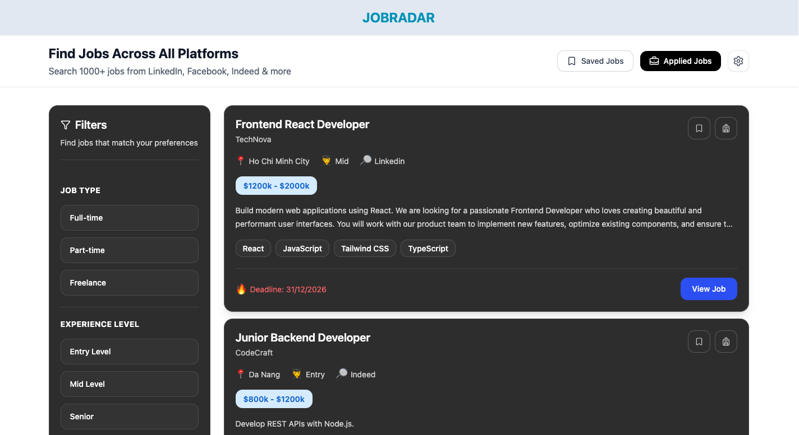
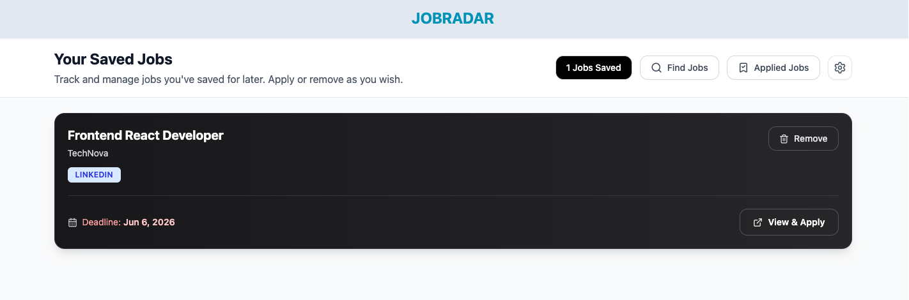
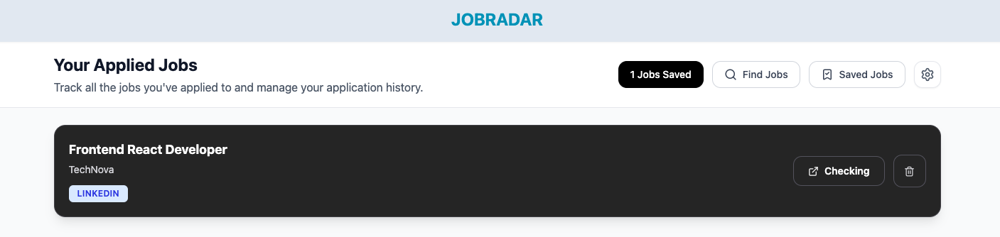
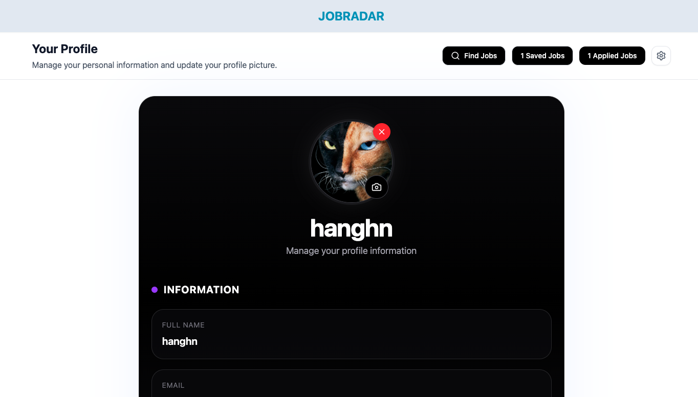

# JobRadar

> A full-stack job aggregator built for the Vietnamese market — search, save, and track job applications in one place.



---

## What is JobRadar?

JobRadar is a personal job tracking application that helps users search for jobs, save listings they're interested in, and keep track of positions they've applied to — all from a single dashboard.

Built as a portfolio project to demonstrate full-stack engineering skills across React, Node.js, MongoDB, and REST API design.

---

## Features

**Job Search & Filter**
Browse job listings with filters for job type (full-time, part-time, freelance), experience level (entry, mid, senior), work mode, salary range, and location. Each card shows company, skills required, salary range, and application deadline at a glance.


**Save Jobs**
Bookmark any job with a single click. Saved jobs are stored in your personal list and can be removed at any time.



**Track Applications**
Mark jobs as applied and manage them separately. Know exactly which positions you've acted on and which are still pending.



**User Profile**
Update your profile picture via Cloudinary upload, and view your account information including name, email, and date joined.



**Authentication**
Secure sign up and login with JWT-based auth stored in HTTP-only cookies. Protected routes ensure only authenticated users can access the app.

---

## Tech Stack

**Frontend**
React, Zustand, React Router DOM, Tailwind CSS, Axios, Lucide React

**Backend**
Node.js, Express.js, MongoDB, Mongoose, JWT, Bcrypt, Cloudinary, Cookie Parser

**Tools**
Vite, pnpm, Git, Postman, Render (backend), Vercel (frontend)

---

## Architecture Decisions

**Why Zustand over Redux?**
Zustand provides a minimal API with less boilerplate for managing auth state, job lists, saved jobs, and applied jobs across the app. Each domain has its own store slice, keeping concerns separated.

**Why HTTP-only cookies for JWT?**
Storing tokens in HTTP-only cookies prevents XSS attacks from accessing the token via JavaScript. More secure than localStorage for auth tokens.

**Why populate() instead of embedding job data in SavedJobs?**
Saved jobs only store `userId` and `jobId` as references. When rendering the saved jobs list, `.populate("jobId")` fetches the full job document in a single query — keeping the saved jobs collection lightweight while still serving rich UI data.

**Flat query params over nested objects**
Early versions sent filter data as nested objects (`location[city][0]=Ha+Noi`). Express couldn't parse this by default. Refactored to flat params (`city=Ha+Noi`) and normalized with `qs` library on the frontend — simpler, more predictable, and framework-agnostic.

---

## What I Learned Building This

This project was built entirely from scratch without following a tutorial. Key engineering lessons from real bugs encountered:

- `.populate()` in Mongoose and how `ref` in schema enables relational-style queries in MongoDB
- Why `<Link>` must replace `<a>` in React Router — browser navigation resets all React state
- Auth timing bugs: protected routes must wait for `authCheck` to complete before rendering, or `authUser` will be `null` for a moment and trigger a false redirect
- Array serialization in query strings — Axios default format vs what Express actually parses
- `req.query` always returns strings — numeric values need explicit conversion with `Number()`
- Middleware must always end with `res.something()` or `next()` — a missing branch silently hangs requests
- `PayloadTooLargeError` when uploading base64 images — Express default body limit is too small, needs `{ limit: "10mb" }`
- Never return `password` in API responses — always `.select("-password")` on user queries

---

## Roadmap

- [ ] Integrate public job APIs (Adzuna, Remotive, The Muse) for real job data
- [ ] Add search by keyword
- [ ] Email notifications for approaching deadlines
- [ ] Mobile responsive improvements
- [ ] Deploy to production

---

## Local Setup

```bash
# Clone the repo
git clone https://github.com/hanghn-dev/Jobradar.git

# Install backend dependencies
cd backend
pnpm install

# Install frontend dependencies
cd ../frontend
pnpm install


# Run backend
cd backend
pnpm dev

# Run frontend
cd frontend
pnpm dev
```

---

## About

Built by **hanghn-dev** — a self-taught full-stack developer based in Hanoi, Vietnam.

This is the primary portfolio project demonstrating ability to design, build, debug, and ship a complete web application independently.

> "Every bug in this project was a lesson. The real learning wasn't in writing the code — it was in debugging it."
