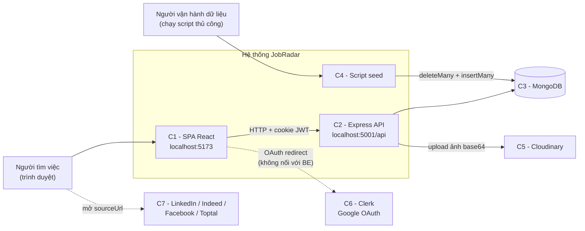
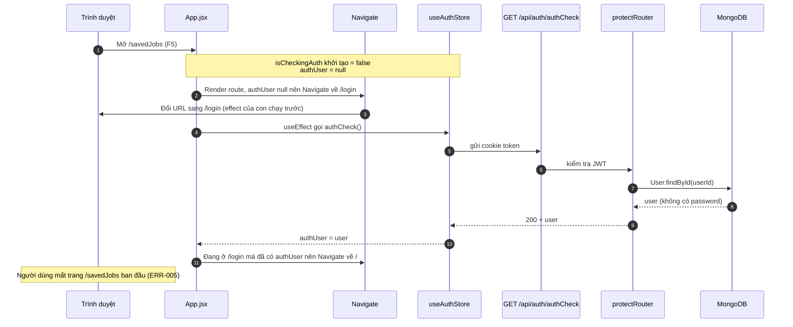
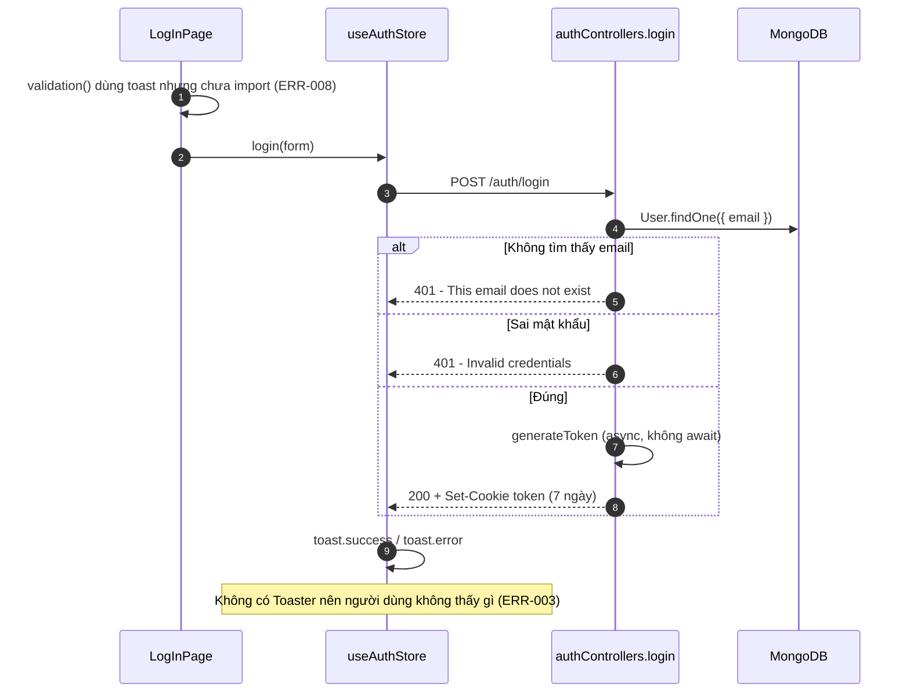
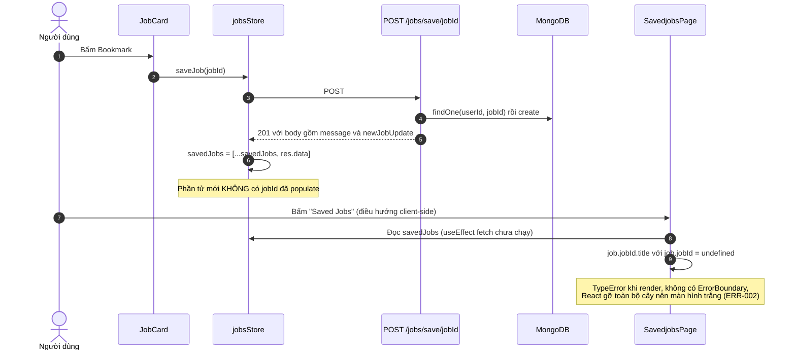
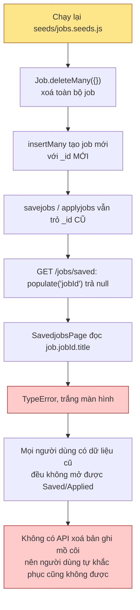
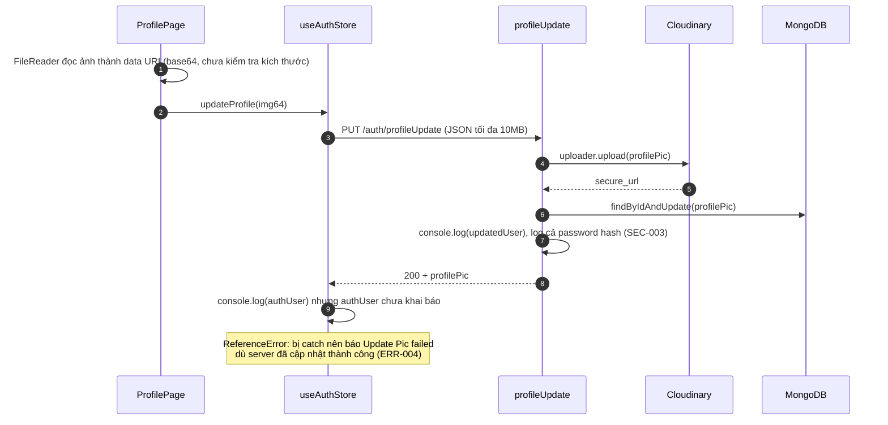
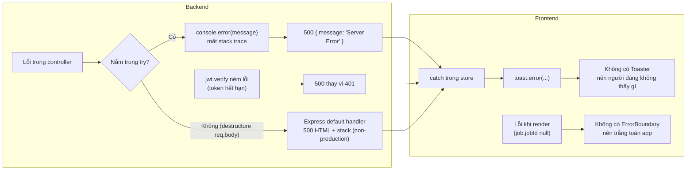

# 02 — Tư duy hệ thống

> [← Mục lục](00-MUC-LUC.md) · [← 01 Tổng quan](01-TONG-QUAN-DU-AN.md) · Tiếp theo: [03 — Kiến trúc hiện tại →](03-KIEN-TRUC-HIEN-TAI.md)

Mục tiêu của phần này là nhìn JobRadar như **một hệ thống gồm nhiều thành phần phụ thuộc nhau**, thay vì một tập file rời rạc. Câu hỏi xuyên suốt là: *khi dữ liệu, request hoặc lỗi đi qua hệ thống thì nó biến đổi thế nào, và nếu một mắt xích hỏng thì những gì khác hỏng theo?*

## 1. Các thành phần của hệ thống

| # | Thành phần | Công nghệ | Trách nhiệm | Vị trí |
|---|---|---|---|---|
| C1 | SPA Frontend | React 19 + Vite + Zustand | Hiển thị, điều hướng, giữ state phía client, gọi API | [frontend/src](../frontend/src) |
| C2 | REST API | Express 5 | Xác thực, kiểm tra quyền sở hữu, truy vấn dữ liệu | [backend/src](../backend/src) |
| C3 | Cơ sở dữ liệu | MongoDB qua Mongoose | Lưu users, jobs, saved, applied | [schemaModel/](../backend/src/schemaModel) |
| C4 | Script seed | Node + Mongoose | **Nguồn dữ liệu job duy nhất** | [seeds/jobs.seeds.js](../backend/seeds/jobs.seeds.js) |
| C5 | Cloudinary | SaaS | Lưu ảnh đại diện | [utils/cloudinary.js](../backend/src/utils/cloudinary.js) |
| C6 | Clerk | SaaS | Google OAuth, **chỉ ở frontend** | [main.jsx](../frontend/src/main.jsx), [SignUpPage.jsx](../frontend/src/Pages/SignUpPage.jsx) |
| C7 | Nền tảng nguồn (LinkedIn, Indeed…) | Web ngoài | Người dùng mở link `sourceUrl` | Không có tích hợp |
| C8 | Trình duyệt | Cookie store | Giữ cookie `token` (JWT) | [generateToken.js](../backend/src/utils/generateToken.js) |

## 2. Sơ đồ ngữ cảnh hệ thống (System Context)

**Điểm cần chú ý trong sơ đồ:**

- Mũi tên Clerk → hệ thống **bị đứt**: Clerk xác thực người dùng ở frontend, nhưng backend chỉ tin cookie JWT do chính nó phát hành. Hai hệ thống xác thực tồn tại song song mà không nói chuyện với nhau (ARCH-001).
- Dữ liệu job **không đi qua API** mà được ghi thẳng vào DB bằng script. Hệ quả là mọi quy tắc nghiệp vụ muốn áp lên job (hết hạn, chống trùng, ẩn/hiện) chỉ có thể nằm trong schema hoặc trong script.

## 3. Quan hệ và sự phụ thuộc

| Thành phần phụ thuộc | Phụ thuộc vào | Kiểu phụ thuộc | Khi phần được phụ thuộc gặp sự cố |
|---|---|---|---|
| C1 SPA | C2 API | Đồng bộ, mọi màn hình | Mọi trang, kể cả trang chủ, không tải được dữ liệu. Thông báo lỗi cũng không hiện vì thiếu `<Toaster/>` (ERR-003). |
| C1 SPA | C6 Clerk | **Bắt buộc lúc khởi tạo** (`ClerkProvider` bọc toàn app) | Thiếu `VITE_CLERK_PUBLISHABLE_KEY` thì toàn bộ app không render (ARCH-001) |
| C1 SPA | Hình dạng JSON trả về của C2 | Ngầm, không có tài liệu | Shape lệch làm crash render (ERR-002, ARCH-002) |
| C2 API | C3 MongoDB | Đồng bộ, mọi route bảo vệ (middleware tra `User` mỗi request) | Lúc khởi động gặp lỗi thì `process.exit(1)` ([connectDB.js:13](../backend/src/utils/connectDB.js#L13)). Lúc đang chạy thì mọi route trả 500. |
| C2 API | C5 Cloudinary | Đồng bộ, chỉ route `profileUpdate` | Chỉ tính năng đổi avatar lỗi (phạm vi ảnh hưởng hẹp, **đây là điểm tốt**) |
| C2 API | Biến môi trường | Đọc rải rác ở 6 file | Thiếu `JWT_SECRET` thì đăng ký/đăng nhập làm **crash tiến trình** (ERR-007) |
| C4 Seed | C3 MongoDB | Ghi đè toàn bộ collection `jobs` | Mọi bản ghi saved/applied trở thành tham chiếu mồ côi (DB-001) |
| Bảng `savejobs`, `applyjobs` | Bảng `jobs` | Tham chiếu `ObjectId` **không có ràng buộc** | Job bị xoá thì `populate` trả `null`, dẫn tới crash frontend |
| Backend chạy được | Hệ điều hành không phân biệt hoa thường | Ngầm (lỗi import) | Trên Linux, server **không khởi động** (ERR-001) |

## 4. Các luồng nghiệp vụ quan trọng

### 4.1. Khởi động phiên (bootstrap xác thực)

**Bài học hệ thống:** README ([README.md:79](../README.md#L79)) ghi rằng *"protected routes must wait for authCheck"*. Ý tưởng đúng, nhưng giá trị khởi tạo `isCheckingAuth: false` ([useAuthStore.js:6](../frontend/src/zustand/useAuthStore.js#L6)) khiến lần render đầu tiên không chờ gì cả. Hiểu đúng khái niệm là chưa đủ: còn phải kiểm tra **trạng thái ban đầu** của hệ thống.

### 4.2. Đăng nhập

Hai thông báo lỗi khác nhau cho phép **dò xem email nào đã đăng ký** (SEC-002).

### 4.3. Duyệt và lọc job: dữ liệu biến đổi qua từng tầng

Đây là ví dụ rõ nhất về việc **thiếu một hợp đồng dữ liệu chung**. Bảng dưới theo dõi cùng một ý định lọc đi qua 5 tầng:

| Tầng | Job Type | City | Region | Salary |
|---|---|---|---|---|
| 1. UI ([JobSidebar.jsx](../frontend/src/components/JobSidebar.jsx#L5-L61)) | `"full-time"` | `"Ha Noi"` | `"Miền Bắc"` | `"lt3k"` |
| 2. Query string (qs, `arrayFormat: repeat`) | `jobType=full-time` | `city=Ha%20Noi` | `region=Mi%E1%BB%81n%20B%E1%BA%AFc` | `salary=lt3k` |
| 3. `req.query` (Express 5, parser "simple") | `"full-time"` | `"Ha Noi"` | `"Miền Bắc"` | `"lt3k"` (chuỗi) |
| 4. Mongo query ([jobsControllers.js](../backend/src/controllers/jobsControllers.js#L16-L44)) | `{ jobType: { $in: [...] } }` | `/Ha\s*Noi/i` | `/Miền\s*Bắc/i` | Code đọc `salary.ranges`, nhưng chuỗi không có thuộc tính này nên **bị bỏ qua** |
| 5. Dữ liệu trong DB ([seed](../backend/seeds/jobs.seeds.js)) | `"full-time"` ✅ | `"Ha Noi"` ✅ | `"Vietnam"` ❌ | `{min:1200, max:2000, currency:"USD", period:"month"}` ❌ |
| **Kết quả** | Lọc đúng | Lọc đúng | **Luôn rỗng** (BIZ-002) | **Không lọc** (BIZ-001) |

**Bài học hệ thống:** mỗi tầng tự đặt ra "ngôn ngữ" riêng. Cột nào có chung một từ điển giá trị ở UI, API và DB thì chạy đúng. Cột nào mỗi tầng tự nghĩ ra giá trị thì hỏng. Cách phòng tránh là định nghĩa **một nguồn sự thật duy nhất** cho các giá trị enum (ví dụ file `constants` dùng chung, hoặc endpoint `GET /api/jobs/filters` trả về các lựa chọn hợp lệ).

### 4.4. Lưu job rồi mở trang "Saved Jobs": luồng dẫn tới crash

### 4.5. Seed lại dữ liệu: ảnh hưởng dây chuyền

Chỉ một thao tác vận hành tưởng vô hại (seed lại dữ liệu test) cũng lan qua **4 thành phần** (script, DB, API, SPA) và cuối cùng làm tê liệt tính năng cho người dùng cuối. Đây là ví dụ điển hình của **ảnh hưởng dây chuyền** (DB-001, DB-003).

### 4.6. Cập nhật ảnh đại diện

## 5. Luồng lỗi (error flow)

Hiểu **lỗi đi đâu** quan trọng không kém hiểu dữ liệu đi đâu.

**Nhận xét:**

1. **Lỗi bị "nuốt" ở cả hai đầu.** Backend chỉ log `error.message` (mất stack trace, khó debug), còn frontend hiện toast nhưng toast không bao giờ được render.
2. **Mã lỗi không phản ánh bản chất.** Token hết hạn trả 500 (ERR-006), dữ liệu thiếu hoặc trùng trả 401 (ERR-009). Hệ thống giám sát sẽ tưởng server hỏng trong khi thực ra người dùng chỉ hết phiên.
3. **Phạm vi ảnh hưởng (blast radius) của lỗi render là toàn bộ ứng dụng**, vì không có ranh giới lỗi nào.

## 6. Điểm nghẽn, điểm lỗi đơn và ảnh hưởng dây chuyền

| Điểm | Loại | Vì sao | Ảnh hưởng dây chuyền | Mã liên quan |
|---|---|---|---|---|
| `ClerkProvider` bọc toàn app | Điểm lỗi đơn (SPOF) cấu hình | Thiếu hoặc sai publishable key thì app không render | Cả tính năng không dùng Clerk (email/password) cũng chết theo | ARCH-001 |
| Lỗi import chữ hoa/thường | SPOF triển khai | Node trên Linux phân biệt hoa thường | Toàn bộ API không khởi động, SPA chỉ còn là vỏ rỗng | ERR-001 |
| Một tiến trình Express duy nhất, MongoDB duy nhất | SPOF hạ tầng | Không có health check, không có cơ chế restart trong repo | Tuỳ nền tảng hosting (chưa đủ dữ liệu) | OPS-002 |
| `protectRouter` truy vấn DB mỗi request | Điểm nghẽn tiềm ẩn | Mỗi request bảo vệ tốn thêm 1 query | Ở quy mô hiện tại **không đáng lo** | PERF-001 |
| `GET /jobs/getjobs` trả toàn bộ job | Điểm nghẽn khi dữ liệu tăng | Không phân trang, không projection | Payload và thời gian render tăng tuyến tính theo số job | BIZ-006, PERF-001 |
| `/jobs/search` công khai + regex từ input | Điểm nghẽn có thể bị khai thác | Không rate limit, regex không dùng được index | Tốn CPU của DB, ảnh hưởng mọi người dùng khác | SEC-005 |
| JSON body 10MB cho **mọi** route | Điểm nghẽn bộ nhớ | Parse JSON lớn trong event loop | Vài request lớn đồng thời có thể làm chậm cả server | SEC-007 |
| Script seed | Điểm phá huỷ dữ liệu | `deleteMany({})` không điều kiện | Xem mục 4.5 | DB-001, DB-003 |
| Store Zustand chứa dữ liệu sai shape | Lỗi lan truyền trong client | Store là global, sống qua các lần chuyển trang | Lỗi ở trang A làm crash trang B | ERR-002 |

## 7. Mức độ nhất quán giữa yêu cầu, thiết kế và code

| Yêu cầu / Tuyên bố | Nguồn | Thiết kế trong code | Nhất quán? |
|---|---|---|---|
| "Full-stack job aggregator" | [README.md:3](../README.md#L3) | Không có module thu thập dữ liệu | ❌ |
| "Search 1000+ jobs from LinkedIn, Facebook, Indeed" | [FindjobsHeader.jsx:14](../frontend/src/components/FindjobsHeader.jsx#L14) | 5 job giả | ❌ |
| Lọc theo salary range và location | [README.md:20](../README.md#L20) | Salary không hoạt động, region lệch dữ liệu | ⚠️ Một phần |
| Card hiển thị salary range và deadline | [README.md:20](../README.md#L20) | Lương hiển thị sai đơn vị, deadline ở trang Saved sai trường | ⚠️ |
| "Know… which are still pending" | [README.md:30](../README.md#L30) | Không có trường trạng thái ứng tuyển | ❌ |
| JWT trong cookie httpOnly | [README.md:40](../README.md#L40) | Đúng | ✅ |
| "Protected routes ensure only authenticated users can access" | [README.md:40](../README.md#L40) | Đúng với UI, nhưng `/api/jobs/search` công khai | ⚠️ |
| "Each domain has its own store slice" | [README.md:60](../README.md#L60) | Chỉ có 2 store; `jobsStore` gộp 3 domain (jobs, saved, applied) | ⚠️ |
| "`.populate()` … in a single query" | [README.md:66](../README.md#L66) | Mongoose `populate` chạy **2 truy vấn** (không phải `$lookup`) | ⚠️ Mô tả chưa chính xác |
| Deploy Render + Vercel | [README.md:53](../README.md#L53) | Hard-code localhost, cookie `SameSite=Strict` | ❌ Chưa sẵn sàng |

## 8. Tổng kết góc nhìn hệ thống

1. **Hệ thống đơn giản, và đó là lựa chọn đúng.** Mô hình SPA + REST API + MongoDB phù hợp với quy mô. Không cần thêm thành phần nào để giải bài toán hiện tại.
2. **Điểm yếu nằm ở ranh giới giữa các thành phần, không nằm bên trong từng thành phần.** Các lỗi nặng nhất đều xuất hiện ở chỗ nối: FE↔BE (shape JSON, giá trị filter), BE↔DB (tham chiếu không ràng buộc), BE↔môi trường (hoa/thường, localhost, cookie), FE↔Clerk.
3. **Hệ thống chưa có "cầu chì".** Không có ErrorBoundary, không có validation ở cửa vào API, không có kiểm tra cấu hình khi khởi động. Vì vậy một lỗi nhỏ lan rộng thành lỗi toàn hệ thống.

Tiếp theo, phần [03 — Kiến trúc hiện tại](03-KIEN-TRUC-HIEN-TAI.md) sẽ đi vào cách các tầng bên trong mỗi thành phần được tổ chức.
