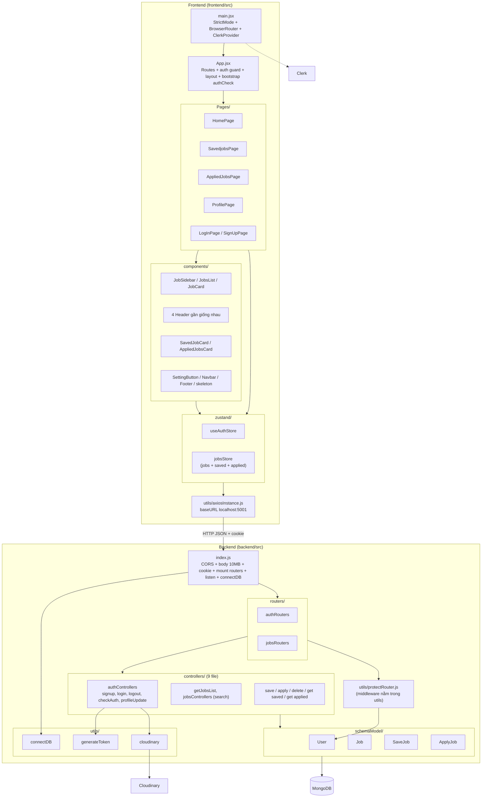
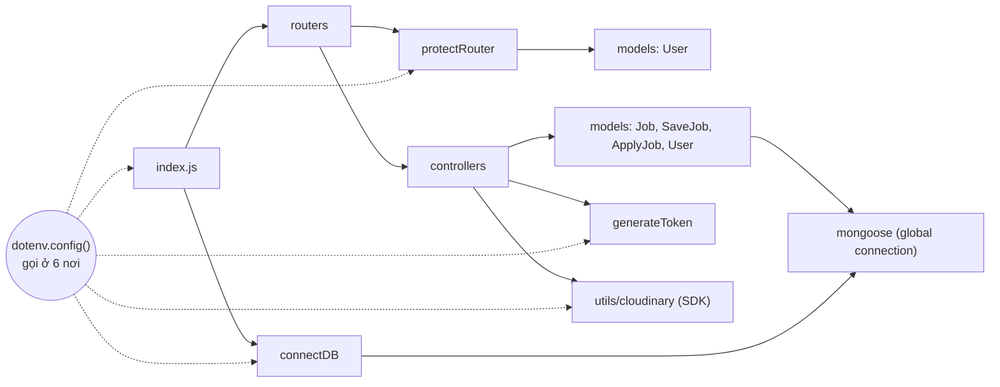
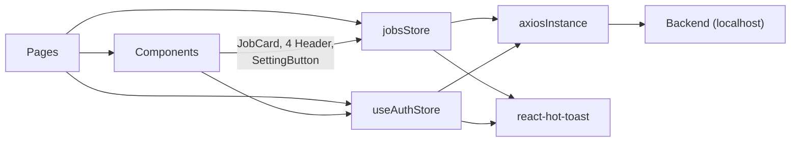
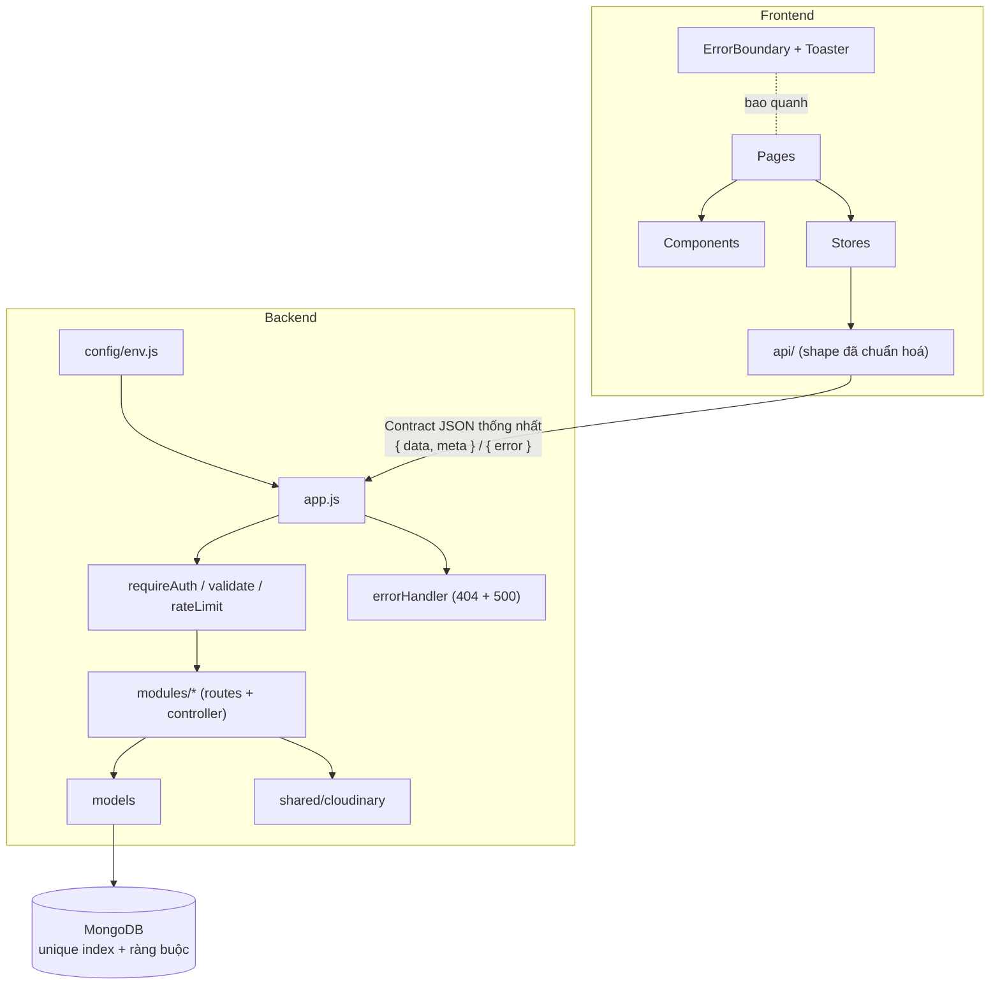

# 03 — Kiến trúc hiện tại

> [← Mục lục](00-MUC-LUC.md) · [← 02 Tư duy hệ thống](02-TU-DUY-HE-THONG.md) · Tiếp theo: [04 — Module và luồng dữ liệu →](04-PHAN-TICH-MODULE-VA-LUONG-DU-LIEU.md)

## 1. Kiến trúc đang sử dụng

| Cấp độ | Kiểu kiến trúc | Nhận định |
|---|---|---|
| Toàn hệ thống | **Client–Server**: SPA gọi REST API. Hai phần deploy độc lập trong cùng một repo (monorepo "thủ công", không có workspace). | Phù hợp với quy mô |
| Backend | **Monolith phân tầng tối giản**: `routers → middleware → controllers → models`. Không có tầng service/repository. | Hợp lý cho ~800 dòng code, nhưng controller đang gánh quá nhiều việc |
| Frontend | **Pages → Components → Global stores (Zustand) → Axios instance** | Hợp lý, nhưng thiếu tầng API client riêng và component bị gắn chặt với store |
| Dữ liệu | MongoDB, các collection liên kết bằng `ObjectId` + `populate` (kiểu "quan hệ trong NoSQL") | Lựa chọn đúng cho quan hệ nhiều-nhiều user↔job, nhưng thiếu ràng buộc (xem [07](07-DATABASE-VA-TOAN-VEN-DU-LIEU.md)) |

## 2. Sơ đồ kiến trúc hiện tại



## 3. Ranh giới module và các tầng

### 3.1. Backend

| Tầng | Thư mục | Trách nhiệm **nên có** | Trách nhiệm **thực tế** | Đánh giá |
|---|---|---|---|---|
| Khởi tạo ứng dụng | [index.js](../backend/src/index.js) | Lắp ráp middleware, router, error handler; kết nối DB rồi mới listen | Lắp middleware, router; listen **trước**, kết nối DB **sau** ([index.js:23-26](../backend/src/index.js#L23-L26)); không có error handler hay 404 handler | ⚠️ |
| Định tuyến | [routers/](../backend/src/routers) | Ánh xạ URL + method tới handler, gắn middleware | Đúng vai trò. Tên route chưa theo REST (`/deleteds`, `/deleteda`, `/getjobs`) | 🟡 |
| Middleware | [utils/protectRouter.js](../backend/src/utils/protectRouter.js) | Xác thực, gắn `req.user` | Đúng vai trò nhưng **đặt trong `utils/`**, trả 500 cho token hết hạn, log cookie | ⚠️ |
| Controller | [controllers/](../backend/src/controllers) | Đọc request, gọi nghiệp vụ, trả response | Làm **tất cả**: validate thủ công, gọi thẳng Mongoose, gọi Cloudinary, sinh JWT, định dạng response | ⚠️ Trách nhiệm lẫn lộn |
| Model | [schemaModel/](../backend/src/schemaModel) | Định nghĩa schema, ràng buộc, index | Có enum/required cho Job; thiếu ràng buộc cho SaveJob/ApplyJob/User | 🟡 |
| Hạ tầng / cấu hình | [utils/](../backend/src/utils) | Kết nối DB, SDK bên ngoài, **đọc cấu hình tập trung** | Mỗi file tự gọi `dotenv.config()` | ⚠️ |
| Dữ liệu mẫu | [seeds/](../backend/seeds) | Tạo dữ liệu dev an toàn, lặp lại được | Xoá sạch collection | ⚠️ |

### 3.2. Frontend

| Tầng | Thư mục | Trách nhiệm **nên có** | Trách nhiệm **thực tế** | Đánh giá |
|---|---|---|---|---|
| Bootstrap | [main.jsx](../frontend/src/main.jsx) | Gắn providers | Gắn `ClerkProvider` bắt buộc cho cả app dù chỉ một nút dùng Clerk | ⚠️ |
| Shell / routing | [App.jsx](../frontend/src/App.jsx) | Khai báo route, layout | Gộp routing, guard, bootstrap auth, layout (Navbar/Footer); guard lặp lại 4 lần | 🟡 |
| Pages | [Pages/](../frontend/src/Pages) | Ghép component, lấy dữ liệu cho màn hình | Đúng vai trò. `ProfilePage` tự xử lý FileReader, `LogInPage`/`SignUpPage` tự validate (trùng lặp) | 🟡 |
| Components | [components/](../frontend/src/components) | Hiển thị theo props, tái sử dụng | `JobCard` và 4 header **gọi store trực tiếp**, nên không tái sử dụng hay test độc lập được | ⚠️ |
| State | [zustand/](../frontend/src/zustand) | Giữ state, điều phối gọi API | Store vừa giữ state, vừa gọi axios, vừa hiện toast, vừa tự "đoán" shape response | ⚠️ |
| API client | [utils/axiosInstance.js](../frontend/src/utils/axiosInstance.js) | Cấu hình base URL, interceptor, timeout | Chỉ có baseURL hard-code, không timeout, không interceptor | ⚠️ |

## 4. Dependency direction (hướng phụ thuộc)

### 4.1. Backend



**Nhận xét:**

- ✅ **Không có vòng phụ thuộc (cycle).** Hướng phụ thuộc đi một chiều từ ngoài vào trong: router → controller → model. Đây là nền tảng tốt.
- ⚠️ **Controller phụ thuộc trực tiếp vào chi tiết hạ tầng** (Mongoose model, Cloudinary SDK, JWT). Theo nguyên tắc Dependency Inversion, nghiệp vụ không nên biết ảnh được lưu ở Cloudinary hay S3. Tuy vậy, **ở quy mô này chưa cần áp dụng đầy đủ DI**. Chỉ cần tách hàm `uploadAvatar()` ra một module riêng là đủ.
- ⚠️ **Cấu hình là "side effect toàn cục".** `dotenv.config()` chạy khi import module, nên việc biến môi trường có được nạp đúng lúc hay không phụ thuộc vào **thứ tự import**. Script seed là ví dụ: [jobs.seeds.js:5](../backend/seeds/jobs.seeds.js#L5) gọi `config({ path: "../.env" })` **sau** khi `connectDB.js` đã tự gọi `dotenv.config()` lúc import. Vì vậy dòng số 5 gần như không có tác dụng như tác giả nghĩ.

### 4.2. Frontend



**Nhận xét:**

- ⚠️ **Component "lá" phụ thuộc vào store toàn cục.** Ví dụ [JobCard.jsx:30](../frontend/src/components/JobCard.jsx#L30) tự gọi `jobsStore()` để lấy `saveJob`, `applyJob`. Hệ quả:
  1. Không dùng lại được `JobCard` ở nơi khác, chẳng hạn trang Saved.
  2. Muốn test `JobCard` phải mock cả store.
  3. Mỗi thay đổi bất kỳ trong store làm **mọi** JobCard re-render, vì gọi store không có selector.
- ⚠️ **Store phụ thuộc vào UI (toast).** Store nên trả kết quả hoặc lỗi để tầng UI quyết định hiển thị gì. Khi store tự gọi toast, không thể dùng lại store trong bối cảnh không muốn hiện thông báo, ví dụ bootstrap `authCheck` đang hiện "Checking Auth successfully" mỗi lần tải trang.

## 5. Điểm hợp lý

1. **Chọn kiến trúc đơn giản, đúng quy mô.** Không có microservice, message queue hay Redis thừa thãi. Đây là quyết định trưởng thành.
2. **Tách router khỏi controller**, và gắn middleware bảo vệ theo từng route ([jobsRouters.js:13-22](../backend/src/routers/jobsRouters.js#L13-L22)).
3. **Mô hình dữ liệu tách `SaveJob`/`ApplyJob` khỏi `Job` bằng reference.** Cách này tránh nhân bản dữ liệu job vào từng user, và README đã giải thích lý do ([README.md:65-66](../README.md#L65-L66)).
4. **Xác thực stateless bằng JWT trong cookie httpOnly.** Nhờ vậy backend có thể chạy nhiều instance mà không cần session store.
5. **Zustand thay vì Redux** hợp với quy mô, ít boilerplate, và lý do chọn được ghi rõ trong README.
6. **Axios instance dùng chung** với `withCredentials: true`, không lặp cấu hình ở từng lời gọi.

## 6. Điểm chưa hợp lý

| # | Vấn đề kiến trúc | Bằng chứng | Hệ quả | Mã |
|---|---|---|---|---|
| 1 | **Không có hợp đồng API** (API contract): mỗi endpoint trả một kiểu JSON | [getJobsList.js:6](../backend/src/controllers/getJobsList.js#L6) trả mảng trần; [jobsControllers.js:56-61](../backend/src/controllers/jobsControllers.js#L56-L61) trả `{success, data, page, totalPages}`; [saveJobControllers.js:24](../backend/src/controllers/saveJobControllers.js#L24) trả `{message, newJobUpdate}` | Store frontend phải "đoán", và đoán sai thì crash | ARCH-002, ERR-002 |
| 2 | **Hai hệ thống xác thực không liên thông** (JWT tự làm + Clerk) | [main.jsx:13](../frontend/src/main.jsx#L13), [SignUpPage.jsx:15-19](../frontend/src/Pages/SignUpPage.jsx#L15-L19); backend không có mã nào liên quan Clerk | Tính năng Google login "giả"; thêm một điểm lỗi đơn cho toàn app | ARCH-001 |
| 3 | **Không có lớp xử lý lỗi và validation tập trung** | Mỗi controller tự `try/catch` và tự `if` kiểm tra; không có `app.use((err, req, res, next) => …)` | Mã lỗi không nhất quán, lỗi ngoài `try` rơi vào handler mặc định (HTML + stack trace) | VAL-001, ERR-009 |
| 4 | **Cấu hình rải rác và hard-code** | `dotenv.config()` ở 6 nơi; `origin: "http://localhost:5173"` ([index.js:12](../backend/src/index.js#L12)); `baseURL: "http://localhost:5001/api"` ([axiosInstance.js:4](../frontend/src/utils/axiosInstance.js#L4)) | Không deploy được nếu không sửa code | OPS-001, ARCH-003 |
| 5 | **Controller "một file một hàm" nhưng đặt tên thiếu quy ước** | `getAppliedJobsRouters.js` là controller; `appliedJobCotrollers.js` sai chính tả; `jobsControllers.js` export `JobsChecking` (thực chất là search) | Khó tìm code, dễ import sai tên (ERR-001 sinh ra từ đây) | ARCH-004 |
| 6 | **`authControllers.js` gánh hai domain** | `profileUpdate` (upload ảnh, cập nhật hồ sơ) nằm chung với signup/login | File phình to, thay đổi hồ sơ có thể ảnh hưởng tới auth | ARCH-004 |
| 7 | **`jobsStore` là "god store"** | [jobsStore.js](../frontend/src/zustand/jobsStore.js) gộp danh sách job, saved, applied, search, cùng 10 cờ loading | Mọi component dùng store đều re-render theo mọi thay đổi | PERF-001 |
| 8 | **Nghiệp vụ trùng lặp** giữa Save và Apply | [saveJobControllers.js](../backend/src/controllers/saveJobControllers.js) và [appliedJobCotrollers.js](../backend/src/controllers/appliedJobCotrollers.js) gần như giống hệt; hai model giống hệt; hai trang, hai card, hai header, hai skeleton | Sửa một bên thì quên bên kia | CODE-002 |
| 9 | **Không có ranh giới lỗi (Error Boundary) ở frontend** | Không tìm thấy `ErrorBoundary` hay `errorElement` | Một lỗi render làm trắng toàn app | ERR-002, DB-001 |

## 7. Đánh giá theo tiêu chí kiến trúc

| Tiêu chí | Mức | Giải thích ngắn |
|---|---|---|
| Separation of Concerns | 🟡 Trung bình | Tách được router/controller/model và page/component/store, nhưng controller và store ôm quá nhiều việc |
| Hướng phụ thuộc & coupling | 🟡 Trung bình | Không có cycle; coupling cao giữa component và store, giữa controller và SDK |
| Khả năng tái sử dụng | 🔴 Thấp | 4 header, 2 card, 2 skeleton, 2 controller được copy thay vì tham số hoá |
| Khả năng mở rộng tính năng | 🟡 Trung bình | Thêm một trạng thái ứng tuyển mới (ví dụ "interview") sẽ phải nhân bản thêm model, controller, route, store, page |
| Quản lý state | 🟡 Trung bình | Zustand dùng hợp lý; nhưng shape dữ liệu trong store không nhất quán và không có selector |
| Quản lý lỗi | 🔴 Thấp | Không có handler tập trung, không có ErrorBoundary, không có Toaster |
| Quản lý cấu hình | 🔴 Thấp | Hard-code, rải rác, không có `.env.example`, không kiểm tra biến khi khởi động |
| Tính nhất quán giữa module | 🔴 Thấp | Đặt tên, mã lỗi, shape response và cách route đều không thống nhất |
| Abstraction | 🟡 Thiếu vừa phải | Thiếu: API client, config, error handler, validate middleware, PageHeader. **Không có over-engineering**. |
| Khả năng thay thế DB / dịch vụ ngoài | 🟡 Trung bình | Thay Cloudinary chỉ ảnh hưởng 1 controller (tốt); thay MongoDB thì phải sửa mọi controller (chấp nhận được ở quy mô này) |
| Khả năng thay đổi phương án deploy | 🔴 Thấp | URL, CORS, cookie đều gắn cứng với localhost |
| Phù hợp độ phức tạp so với quy mô | 🟢 Tốt | Kiến trúc không quá phức tạp, chỉ thiếu vài lớp mỏng cần thiết |

## 8. Kiến trúc đề xuất (chỉ là định hướng, không sửa code)

> **Nguyên tắc:** không viết lại, không thêm tầng chỉ vì "chuẩn". Mỗi thay đổi dưới đây đều giải quyết một vấn đề **đã được chứng minh** ở phần trên.

### 8.1. Backend: tổ chức theo feature, thêm 3 lớp mỏng

```text
backend/src/
├── app.js                 # tạo express app (không listen) → test được bằng supertest
├── server.js              # đọc config, connect DB, rồi listen
├── config/
│   └── env.js             # đọc + kiểm tra biến môi trường MỘT lần (ARCH-003, OPS-002)
├── middlewares/
│   ├── requireAuth.js     # thay utils/protectRouter.js (ERR-006)
│   ├── validate.js        # validate body/params/query theo schema (VAL-001)
│   └── errorHandler.js    # 404 + lỗi tập trung, không lộ stack (ERR-009)
├── modules/
│   ├── auth/              # auth.routes.js, auth.controller.js, auth.validation.js
│   ├── users/             # profile, avatar (tách khỏi auth)
│   ├── jobs/              # list + filter + phân trang (gộp getjobs & search)
│   └── bookmarks/         # saved + applied (gộp logic trùng lặp)
└── shared/
    ├── httpError.js       # class lỗi có status code
    └── cloudinary.js
```

**Không đề xuất** tầng repository hay dependency injection container: chúng chưa cần thiết với ~10 truy vấn đơn giản.

### 8.2. Frontend: tách API client, dùng selector, thêm ranh giới lỗi

```text
frontend/src/
├── api/
│   ├── http.js            # axios instance: baseURL từ import.meta.env, timeout
│   ├── authApi.js
│   └── jobsApi.js         # hàm trả dữ liệu ĐÃ chuẩn hoá shape
├── stores/                # chỉ giữ state + gọi api, KHÔNG gọi toast
├── components/
│   ├── layout/PageHeader.jsx   # thay 4 header gần giống nhau
│   ├── jobs/JobCard.jsx        # nhận onSave/onApply qua props
│   └── ErrorBoundary.jsx
├── pages/
└── routes/ProtectedRoute.jsx   # gom guard lặp lại trong App.jsx
```

### 8.3. Sơ đồ kiến trúc đề xuất



### 8.4. Lộ trình chuyển đổi dần dần (không big-bang)

1. Thêm `config/env.js` và `errorHandler`. Không cần đổi controller nào.
2. Thêm middleware `validate` cho **từng** route khi chạm vào route đó.
3. Chuẩn hoá response của `save`/`apply`, đồng thời sửa store (xử lý ERR-002).
4. Khi cần thêm trạng thái ứng tuyển, lúc đó mới gộp `SaveJob` và `ApplyJob` (xem mục "Thảo luận thiết kế" trong [07](07-DATABASE-VA-TOAN-VEN-DU-LIEU.md)).

Thứ tự ưu tiên cụ thể nằm trong [12 — Lộ trình cải thiện](12-LO-TRINH-CAI-THIEN.md).
