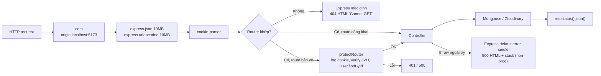
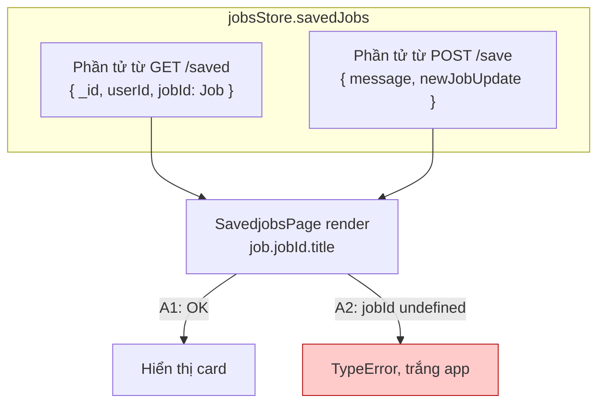

# 04 — Phân tích module và luồng dữ liệu

> [← Mục lục](00-MUC-LUC.md) · [← 03 Kiến trúc](03-KIEN-TRUC-HIEN-TAI.md) · Tiếp theo: [05 — Danh sách lỗi và rủi ro →](05-DANH-SACH-LOI-VA-RUI-RO.md)

## 1. Danh sách module backend

| Module          | File                                                                                    | Trách nhiệm                                              | Đầu vào                                       | Đầu ra                              | Phụ thuộc                                        | Nhận xét                                                                      |
| --------------- | --------------------------------------------------------------------------------------- | -------------------------------------------------------- | --------------------------------------------- | ----------------------------------- | ------------------------------------------------ | ----------------------------------------------------------------------------- |
| Entry           | [index.js](../backend/src/index.js)                                                     | Cấu hình CORS, body parser, cookie, mount router, listen | `process.env.PORT`                            | HTTP server                         | express, cors, cookie-parser, routers, connectDB | Listen trước khi có DB; không có error handler; CORS hard-code                |
| Auth router     | [authRouters.js](../backend/src/routers/authRouters.js)                                 | Định tuyến `/api/auth/*`                                 | —                                             | —                                   | authControllers, protectRouter                   | Import `authControllers` hai lần (dòng 2-7 và 9)                              |
| Jobs router     | [jobsRouters.js](../backend/src/routers/jobsRouters.js)                                 | Định tuyến `/api/jobs/*`                                 | —                                             | —                                   | 8 controller, protectRouter                      | **Import sai hoa/thường** ở dòng 5 (ERR-001); `/search` không bảo vệ          |
| Auth middleware | [protectRouter.js](../backend/src/utils/protectRouter.js)                               | Xác minh JWT, gắn `req.user`                             | Cookie `token`                                | `req.user` hoặc 401/500             | jsonwebtoken, User                               | Log cookie (SEC-003); 500 cho token lỗi (ERR-006)                             |
| Auth controller | [authControllers.js](../backend/src/controllers/authControllers.js)                     | signup, login, logout, checkAuth, **profileUpdate**      | `req.body`, `req.user`                        | JSON user + cookie                  | bcryptjs, User, generateToken, cloudinary        | 135 dòng, gánh 2 domain; nhiều nhánh validation dùng sai mã 401               |
| Job list        | [getJobsList.js](../backend/src/controllers/getJobsList.js)                             | Lấy **toàn bộ** job                                      | —                                             | `Job[]` (mảng trần)                 | Job                                              | Không lọc `isActive`/hết hạn, không phân trang                                |
| Job search      | [jobsControllers.js](../backend/src/controllers/jobsControllers.js)                     | Lọc + phân trang                                         | `req.query`                                   | `{success, data, page, totalPages}` | Job                                              | Tên export `JobsChecking` không phản ánh chức năng; nhánh salary là dead code |
| Save job        | [saveJobControllers.js](../backend/src/controllers/saveJobControllers.js)               | Tạo bookmark                                             | `:jobId`, `req.user`                          | `{message, newJobUpdate}`           | SaveJob                                          | Không kiểm tra Job tồn tại; check-then-act                                    |
| Apply job       | [appliedJobCotrollers.js](../backend/src/controllers/appliedJobCotrollers.js)           | Đánh dấu đã ứng tuyển                                    | `:jobId`, `req.user`                          | `{message, newJobApply}`            | ApplyJob                                         | Bản sao gần như y hệt Save job                                                |
| Get saved       | [getSavedJobsController.js](../backend/src/controllers/getSavedJobsController.js)       | Danh sách bookmark của user                              | `req.user`                                    | `{savedJobs}`                       | SaveJob (+populate Job)                          | Log toàn bộ dữ liệu ra console                                                |
| Get applied     | [getAppliedJobsRouters.js](../backend/src/controllers/getAppliedJobsRouters.js)         | Danh sách đã ứng tuyển                                   | `req.user`                                    | `{appliedJobs}`                     | ApplyJob (+populate Job)                         | Tên file có hậu tố "Routers" nhưng là controller                              |
| Delete saved    | [deleteSavedJobControllers.js](../backend/src/controllers/deleteSavedJobControllers.js) | Xoá bookmark                                             | `:jobId` (**thực chất là `_id` của SaveJob**) | `{message, deleteJob}`              | SaveJob                                          | 2 truy vấn cho 1 thao tác; tên param gây hiểu nhầm                            |
| Delete applied  | [deleteApplyJobControllers.js](../backend/src/controllers/deleteApplyJobControllers.js) | Xoá đánh dấu ứng tuyển                                   | `:jobId` (thực chất `_id` của ApplyJob)       | `{message, deleteJob}`              | ApplyJob                                         | Bản sao của Delete saved                                                      |
| Models          | [schemaModel/](../backend/src/schemaModel)                                              | Schema User, Job, SaveJob, ApplyJob                      | —                                             | Mongoose models                     | mongoose                                         | Xem [07](07-DATABASE-VA-TOAN-VEN-DU-LIEU.md)                                  |
| DB connection   | [connectDB.js](../backend/src/utils/connectDB.js)                                       | Kết nối MongoDB                                          | `MONGOO_URI`                                  | Kết nối global                      | mongoose, dotenv                                 | `process.exit(1)` khi lỗi                                                     |
| Token           | [generateToken.js](../backend/src/utils/generateToken.js)                               | Ký JWT, set cookie                                       | `userId`, `res`                               | Cookie `token`                      | jsonwebtoken, dotenv                             | Khai báo `async` không cần thiết và không được `await` (ERR-007)              |
| Cloudinary      | [cloudinary.js](../backend/src/utils/cloudinary.js)                                     | Cấu hình SDK                                             | 3 biến env                                    | Instance SDK                        | cloudinary, dotenv                               | Ổn                                                                            |
| Seed            | [jobs.seeds.js](../backend/seeds/jobs.seeds.js)                                         | Nạp 5 job mẫu                                            | `.env`                                        | Ghi đè collection `jobs`            | connectDB, Job                                   | Phá huỷ dữ liệu; không có script chạy                                         |

## 2. Danh sách module frontend

| Module                            | File                                                                                                                                                                                                                                                                           | Trách nhiệm                                              | Đọc state                                  | Ghi state / gọi API                    | Nhận xét                                                                                                                                          |
| --------------------------------- | ------------------------------------------------------------------------------------------------------------------------------------------------------------------------------------------------------------------------------------------------------------------------------ | -------------------------------------------------------- | ------------------------------------------ | -------------------------------------- | ------------------------------------------------------------------------------------------------------------------------------------------------- |
| Bootstrap                         | [main.jsx](../frontend/src/main.jsx)                                                                                                                                                                                                                                           | Mount React, Router, Clerk                               | `VITE_CLERK_PUBLISHABLE_KEY`               | —                                      | Clerk bắt buộc cho toàn app                                                                                                                       |
| Shell                             | [App.jsx](../frontend/src/App.jsx)                                                                                                                                                                                                                                             | Route, guard, layout, gọi `authCheck`                    | `authUser`, `isCheckingAuth`               | `authCheck()`                          | Guard lặp 4 lần; `console.log` mỗi lần render                                                                                                     |
| Auth store                        | [useAuthStore.js](../frontend/src/zustand/useAuthStore.js)                                                                                                                                                                                                                     | Trạng thái đăng nhập, gọi API auth                       | —                                          | 5 endpoint auth                        | `updateProfile` có ReferenceError (ERR-004)                                                                                                       |
| Jobs store                        | [jobsStore.js](../frontend/src/zustand/jobsStore.js)                                                                                                                                                                                                                           | Danh sách job, saved, applied; search; save/apply/delete | —                                          | 7 endpoint jobs                        | Chèn sai shape sau save/apply (ERR-002)                                                                                                           |
| HTTP client                       | [axiosInstance.js](../frontend/src/utils/axiosInstance.js)                                                                                                                                                                                                                     | Axios với cookie                                         | —                                          | —                                      | Hard-code URL, không timeout                                                                                                                      |
| HomePage                          | [HomePage.jsx](../frontend/src/Pages/HomePage.jsx)                                                                                                                                                                                                                             | Trang tìm việc                                           | `jobsList`, `isLoadingJobs`                | `getJobs()`                            | Mỗi lần vào trang gọi lại `getJobs`, nên kết quả lọc bị mất                                                                                       |
| JobSidebar                        | [JobSidebar.jsx](../frontend/src/components/JobSidebar.jsx)                                                                                                                                                                                                                    | Bộ lọc                                                   | `isSearchingJobs`                          | `searchJobs(payload)`                  | Giá trị salary/region lệch backend (BIZ-001/002)                                                                                                  |
| JobsList / JobCard                | [JobsList.jsx](../frontend/src/components/JobsList.jsx), [JobCard.jsx](../frontend/src/components/JobCard.jsx)                                                                                                                                                                 | Hiển thị job, nút Save/Apply/View                        | `jobsList`, `savingJobId`, `applyingJobId` | `saveJob`, `applyJob`                  | JobCard đọc 5 props không tồn tại trong dữ liệu, trong đó `url` (dữ liệu là `sourceUrl`) làm nút "View Job" vô hiệu (BIZ-009); hiển thị lương sai |
| SavedjobsPage / SavedJobCard      | [SavedjobsPage.jsx](../frontend/src/Pages/SavedjobsPage.jsx), [SavedJobCard.jsx](../frontend/src/components/SavedJobCard.jsx)                                                                                                                                                  | Danh sách bookmark                                       | `savedJobs`                                | `fetchSavedJobs`, `deleteSavedJob`     | Đọc `job.jobId.title` không kiểm tra null; deadline sai trường                                                                                    |
| AppliedJobsPage / AppliedJobsCard | [AppliedJobsPage.jsx](../frontend/src/Pages/AppliedJobsPage.jsx), [AppliedJobsCard.jsx](../frontend/src/components/AppliedJobsCard.jsx)                                                                                                                                        | Danh sách đã ứng tuyển                                   | `appliedJobs`                              | `fetchAppliedJobs`, `deleteAppliedJob` | Như trên; không có empty state                                                                                                                    |
| ProfilePage                       | [ProfilePage.jsx](../frontend/src/Pages/ProfilePage.jsx)                                                                                                                                                                                                                       | Hồ sơ, đổi avatar                                        | `authUser`, `isUpdatingProfile`            | `updateProfile`                        | Nút X chỉ xoá preview; ảnh mặc định hotlink bên ngoài                                                                                             |
| LogInPage / SignUpPage            | [LogInPage.jsx](../frontend/src/Pages/LogInPage.jsx), [SignUpPage.jsx](../frontend/src/Pages/SignUpPage.jsx)                                                                                                                                                                   | Form auth                                                | `isLoggingIn`/`isSigningUp`                | `login`/`signup`, Clerk                | Validate trùng lặp; LogInPage thiếu import toast                                                                                                  |
| Headers (x4)                      | [FindjobsHeader](../frontend/src/components/FindjobsHeader.jsx), [SavedJobsHeader](../frontend/src/components/SavedJobsHeader.jsx), [AppliedJobsHeader](../frontend/src/components/AppliedJobsHeader.jsx), [HeadeProfilepage](../frontend/src/components/HeadeProfilepage.jsx) | Tiêu đề + điều hướng                                     | `savedJobs`/`appliedJobs`                  | —                                      | Gần như trùng lặp; AppliedJobsHeader ghi nhầm "Jobs Saved"                                                                                        |
| SettingButton                     | [SettingButton.jsx](../frontend/src/components/SettingButton.jsx)                                                                                                                                                                                                              | Dropdown Setting/Logout                                  | —                                          | `logout`                               | Có dọn event listener khi unmount (tốt)                                                                                                           |
| Navbar / Footer                   | [Navbar.jsx](../frontend/src/components/Navbar.jsx), [Footer.jsx](../frontend/src/components/Footer.jsx)                                                                                                                                                                       | Layout                                                   | —                                          | —                                      | Logo là `<a>` không có href                                                                                                                       |
| Skeleton (x2)                     | [skeleton /](../frontend/src/components/skeleton%20/)                                                                                                                                                                                                                          | Placeholder khi tải                                      | —                                          | —                                      | Hai file giống hệt nhau; tên thư mục có dấu cách ở cuối                                                                                           |

## 3. Danh mục API (API catalog) được suy ra từ code

Repo không có tài liệu API. Bảng dưới được **suy ra từ code**, và đây là loại tài liệu nên có trong README hoặc OpenAPI.

| #   | Method | Path                        | Bảo vệ    | Đầu vào                                                                                                | Response thành công                                                  | Response lỗi                                                          |
| --- | ------ | --------------------------- | --------- | ------------------------------------------------------------------------------------------------------ | -------------------------------------------------------------------- | --------------------------------------------------------------------- |
| 1   | POST   | `/api/auth/signup`          | Không     | body `fullName`, `email`, `password`                                                                   | 201 `{fullName, email, profilePic, createdAt}` + cookie              | 401 (thiếu trường, sai email, email đã tồn tại, mật khẩu ngắn), 500   |
| 2   | POST   | `/api/auth/login`           | Không     | body `email`, `password`                                                                               | 200 `{fullName, email, profilePic, createdAt}` + cookie              | 401 (thiếu trường, **email không tồn tại**, **sai mật khẩu**), 500    |
| 3   | POST   | `/api/auth/logout`          | Không     | —                                                                                                      | 200 `{message}` + xoá cookie                                         | 500                                                                   |
| 4   | GET    | `/api/auth/authCheck`       | Cookie    | —                                                                                                      | 200 `{message, user}` (user **có `_id`, `updatedAt`, `__v`**)        | 401 (không có token, user không tồn tại), **500 (token sai/hết hạn)** |
| 5   | PUT    | `/api/auth/profileUpdate`   | Cookie    | body `profilePic` (data URI hoặc `""`)                                                                 | 200 `{message, profilePic}`                                          | 401 (thiếu), 500; **treo** nếu `profilePic` là `false`/`0`            |
| 6   | GET    | `/api/jobs/getjobs`         | Cookie    | —                                                                                                      | 200 `Job[]`                                                          | 500                                                                   |
| 7   | GET    | `/api/jobs/saved`           | Cookie    | —                                                                                                      | 200 `{savedJobs: SaveJob[]}` (đã populate `jobId`, có thể là `null`) | 500                                                                   |
| 8   | GET    | `/api/jobs/applied`         | Cookie    | —                                                                                                      | 200 `{appliedJobs: ApplyJob[]}` (populate, có thể `null`)            | 500                                                                   |
| 9   | GET    | `/api/jobs/search`          | **Không** | query `jobType`, `experienceLevel`, `workMode`, `city`, `region`, `page`, (`salary` không có tác dụng) | 200 `{success, data, page, totalPages}`                              | 500 (kể cả khi regex sai cú pháp)                                     |
| 10  | POST   | `/api/jobs/save/:jobId`     | Cookie    | `jobId` = `_id` của **Job**                                                                            | 201 `{message, newJobUpdate}`                                        | 401 (đã lưu), 500 (id sai định dạng)                                  |
| 11  | POST   | `/api/jobs/apply/:jobId`    | Cookie    | `jobId` = `_id` của **Job**                                                                            | 201 `{message, newJobApply}`                                         | 401 (đã ứng tuyển), 500                                               |
| 12  | DELETE | `/api/jobs/deleteds/:jobId` | Cookie    | `jobId` = `_id` của **SaveJob**                                                                        | 200 `{message, deleteJob}`                                           | 404, 500                                                              |
| 13  | DELETE | `/api/jobs/deleteda/:jobId` | Cookie    | `jobId` = `_id` của **ApplyJob**                                                                       | 200 `{message, deleteJob}`                                           | 404, 500                                                              |

### 3.1. Những điểm bất nhất có thể đọc ra ngay từ bảng

1. **Cùng tên param `:jobId` nhưng mang hai nghĩa khác nhau.** Ở route 10–11 nó là id của Job, còn ở route 12–13 lại là id của bản ghi bookmark. Người đọc code (và chính tác giả sau vài tháng) rất dễ gửi nhầm id.
2. **Shape của "user" khác nhau giữa các endpoint.** Route 1–2 trả object không có `_id`, route 4 trả đủ trường. Store gán cả hai vào cùng biến `authUser`, nên tính năng nào cần `authUser._id` sẽ chạy hay không tuỳ người dùng vừa login hay vừa F5.
3. **Có 4 kiểu envelope khác nhau** cho response thành công: mảng trần, `{data}`, `{savedJobs}`/`{appliedJobs}`, `{message, <tên-tuỳ-ý>}`.
4. **Hai endpoint cùng trả danh sách job** (6 và 9) nhưng khác nhau về quyền truy cập, bộ lọc `isActive`, phân trang và shape.
5. **Mã 401 bị dùng cho 5 ý nghĩa khác nhau**: chưa đăng nhập, dữ liệu thiếu, email sai định dạng, trùng lặp, sai mật khẩu.

## 4. Luồng request qua backend

**Nhận xét:** pipeline thiếu 4 mắt xích thường gặp là security headers, rate limit, validate và error handler JSON. Tất cả đều là middleware nhỏ, có thể thêm vào mà không cần sửa controller.

## 5. Luồng dữ liệu trong state frontend

| State                                                                        | Store | Được ghi bởi                                                                                                                        | Được đọc bởi                                     | Vấn đề                                                       |
| ---------------------------------------------------------------------------- | ----- | ----------------------------------------------------------------------------------------------------------------------------------- | ------------------------------------------------ | ------------------------------------------------------------ |
| `authUser`                                                                   | auth  | `authCheck` (user đầy đủ), `login`/`signup` (user rút gọn), `updateProfile` (**chuỗi URL**, nếu không bị ReferenceError chặn trước) | App (guard), ProfilePage                         | Một biến chứa 3 kiểu dữ liệu khác nhau                       |
| `isCheckingAuth`                                                             | auth  | `authCheck`                                                                                                                         | App                                              | Khởi tạo `false` (ERR-005)                                   |
| `jobsList`                                                                   | jobs  | `getJobs` (**tất cả** job), `searchJobs` (**10** job đã lọc)                                                                        | JobsList                                         | Hai nguồn ghi đè lẫn nhau; quay lại Home thì mất kết quả lọc |
| `savedJobs`                                                                  | jobs  | `fetchSavedJobs` (SaveJob đã populate), `saveJob` (**`{message, newJobUpdate}`**), `deleteSavedJob` (lọc theo `_id`)                | SavedjobsPage, SavedJobsHeader, HeadeProfilepage | Phần tử có hai shape khác nhau, gây crash (ERR-002)          |
| `appliedJobs`                                                                | jobs  | Tương tự `savedJobs`                                                                                                                | Tương tự                                         | Tương tự                                                     |
| `savingJobId` / `applyingJobId`                                              | jobs  | save/apply                                                                                                                          | JobCard                                          | **Tốt:** loading theo từng job                               |
| `isSavingJob`, `isApplyingJob`, `isDeletingSavedJob`, `isDeletingAppliedJob` | jobs  | **Không ai ghi**                                                                                                                    | **Không ai đọc**                                 | Dead state (CODE-001)                                        |

## 6. Luồng lỗi theo từng module

| Module                      | Lỗi sinh ra                | Được xử lý ở đâu                      | Người dùng thấy gì                                 | Dev thấy gì                                            |
| --------------------------- | -------------------------- | ------------------------------------- | -------------------------------------------------- | ------------------------------------------------------ |
| protectRouter               | Token hết hạn              | catch trả 500                         | Không thấy gì (không có Toaster), bị đưa về /login | Log "ProtectRouter Checking Error", **không có lý do** |
| authControllers.login       | Sai mật khẩu               | Nhánh 401                             | Không thấy gì                                      | Không có log                                           |
| authControllers (body rỗng) | `TypeError` destructure    | **Không**, rơi xuống handler mặc định | Không thấy gì                                      | Stack trace trong response HTML                        |
| save/apply                  | ObjectId sai               | catch trả 500                         | Không thấy gì                                      | `Cast to ObjectId failed`                              |
| profileUpdate               | Cloudinary lỗi             | catch trả 500                         | Preview vẫn hiện như thành công                    | `error.message`                                        |
| jobsStore → SavedjobsPage   | `job.jobId` undefined/null | **Không**                             | Màn hình trắng                                     | Lỗi trong console trình duyệt                          |
| LogInPage.validation        | `toast` chưa import        | **Không**                             | Bấm Login không có phản hồi                        | `ReferenceError` trong console                         |
| useAuthStore.updateProfile  | `authUser` chưa khai báo   | catch → `toast.error`                 | Không thấy gì                                      | Không log (catch nuốt lỗi)                             |

## 7. Module quá lớn, quá phụ thuộc hoặc sai trách nhiệm

| Module                                                              | Loại vấn đề                            | Bằng chứng                                                                                                                                                                                                | Đề xuất                                                                                                                        |
| ------------------------------------------------------------------- | -------------------------------------- | --------------------------------------------------------------------------------------------------------------------------------------------------------------------------------------------------------- | ------------------------------------------------------------------------------------------------------------------------------ |
| [authControllers.js](../backend/src/controllers/authControllers.js) | **Sai trách nhiệm**, ôm 2 domain       | `profileUpdate` gọi Cloudinary nằm chung file với login/signup                                                                                                                                            | Tách `users/profile.controller.js`                                                                                             |
| [jobsStore.js](../frontend/src/zustand/jobsStore.js)                | **Quá lớn về trách nhiệm**             | 3 domain, 10 biến trạng thái (4 cờ không bao giờ được dùng), gọi API, gọi toast                                                                                                                           | Tách hàm API ra `api/jobsApi.js`; cân nhắc tách `savedStore`/`appliedStore` hoặc gộp thành `bookmarksStore` có trường `status` |
| [JobCard.jsx](../frontend/src/components/JobCard.jsx)               | **Quá phụ thuộc** + props lệch dữ liệu | Tự gọi `jobsStore()`; khai báo props `daysLeft`, `experience`, `tags`, `source`, `url` nhưng dữ liệu Job không có trường nào trong số này. Riêng `url` khiến nút "View Job" **không có `href`** (BIZ-009) | Nhận `onSave`, `onApply`, `isSaving` qua props; bỏ props thừa                                                                  |
| [App.jsx](../frontend/src/App.jsx)                                  | **Trộn trách nhiệm**                   | Routing + guard + bootstrap + layout                                                                                                                                                                      | Tách `ProtectedRoute`, `GuestRoute`                                                                                            |
| [protectRouter.js](../backend/src/utils/protectRouter.js)           | **Đặt sai chỗ**                        | Middleware nằm trong `utils/`                                                                                                                                                                             | Chuyển vào `middlewares/`                                                                                                      |
| [jobsControllers.js](../backend/src/controllers/jobsControllers.js) | **Tên sai chức năng** + dead code      | Export `JobsChecking` nhưng làm search; nhánh `salary.ranges` không bao giờ chạy                                                                                                                          | Đổi tên `searchJobs`; xoá hoặc thiết kế lại salary filter                                                                      |
| [main.jsx](../frontend/src/main.jsx)                                | **Phụ thuộc thừa ở cấp toàn cục**      | `ClerkProvider` bọc toàn app                                                                                                                                                                              | Nếu giữ Clerk thì chỉ bọc quanh phần cần; nếu không thì gỡ                                                                     |

## 8. Tóm tắt

- Về **số lượng**, module được chia khá nhỏ. Về **ranh giới trách nhiệm**, cách chia chưa đúng: có chỗ chia quá vụn (mỗi controller một file, tên không thống nhất), có chỗ gộp quá nhiều (authControllers, jobsStore, App).
- **Vấn đề lớn nhất nằm giữa các module:** tên tham số mơ hồ, shape dữ liệu không ổn định, mã lỗi không mang ý nghĩa. Chỉ riêng việc viết ra bảng API catalog ở mục 3 trước khi code đã có thể ngăn được ERR-002, BIZ-001 và BIZ-002.
