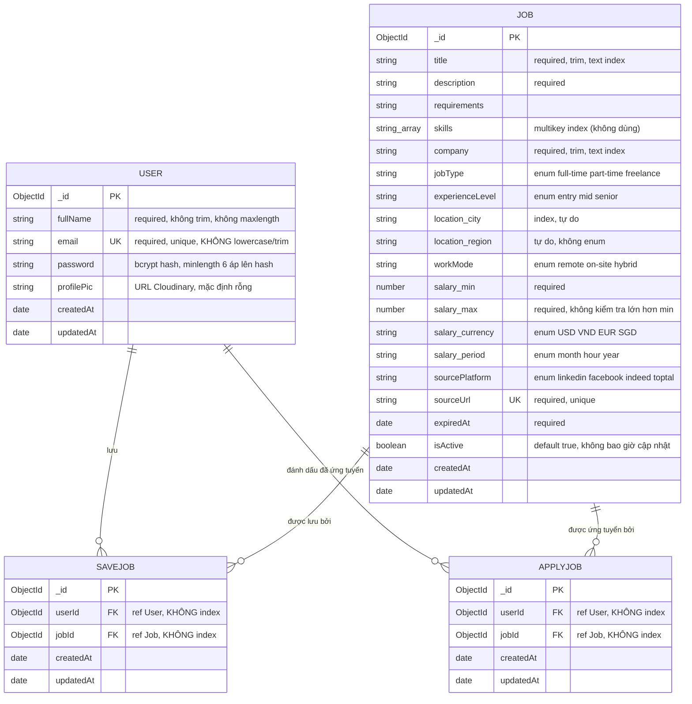
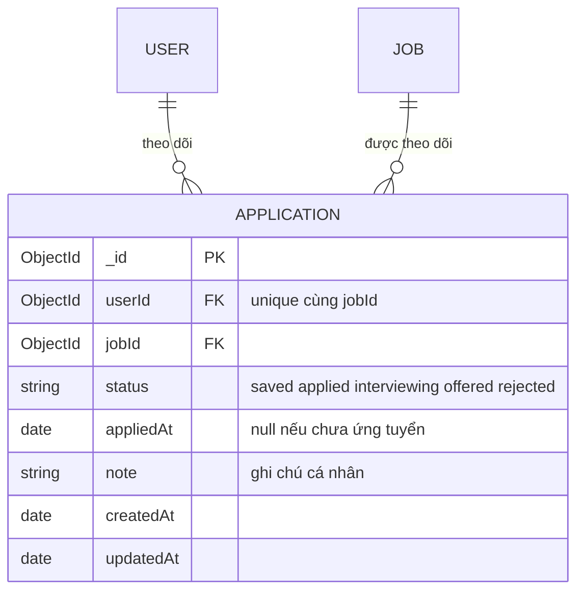

# 07 — Database và toàn vẹn dữ liệu

> [← Mục lục](00-MUC-LUC.md) · [← 06 Chất lượng code](06-CHAT-LUONG-CODE.md) · Tiếp theo: [08 — Bảo mật và phân quyền →](08-BAO-MAT-VA-PHAN-QUYEN.md)

## 1. Mô hình dữ liệu tổng quan

Hệ quản trị: **MongoDB**, truy cập qua **Mongoose 9.6.2**. Có 4 model, tương ứng 4 collection (Mongoose tự đổi tên model sang chữ thường số nhiều):

| Model | Collection | File | Vai trò |
|---|---|---|---|
| `User` | `users` | [userSchema.js](../backend/src/schemaModel/userSchema.js) | Tài khoản người dùng |
| `Job` | `jobs` | [jobschema.js](../backend/src/schemaModel/jobschema.js) | Tin tuyển dụng (chỉ được nạp bằng seed) |
| `SaveJob` | `savejobs` | [savedJobsschema.js](../backend/src/schemaModel/savedJobsschema.js) | Quan hệ "user đã lưu job" |
| `ApplyJob` | `applyjobs` | [appliedJobschema.js](../backend/src/schemaModel/appliedJobschema.js) | Quan hệ "user đã ứng tuyển job" |

### Sơ đồ ER

> Ghi chú: "FK" trong sơ đồ chỉ mang tính khái niệm. MongoDB **không** thực thi khoá ngoại; `ref` trong Mongoose chỉ phục vụ `populate`.

## 2. Đánh giá từng collection

### 2.1. `users`

| Trường | Nhận xét |
|---|---|
| `email` | ✅ `unique`. ⚠️ Thiếu `lowercase: true`, `trim: true`, nên `A@b.com` và `a@b.com` là hai tài khoản khác nhau (DB-004). Chỉ validate định dạng ở controller, schema không có `match`. |
| `password` | ✅ Lưu hash bcrypt. ⚠️ `minlength: 6` kiểm tra **chuỗi hash** (luôn 60 ký tự), không có tác dụng. Nên đặt `select: false` để mặc định không bao giờ bị lấy ra (đã có trường hợp bị log ra ở SEC-003). |
| `fullName` | ⚠️ Không `trim`, không `maxlength`. |
| `profilePic` | Chỉ lưu URL, không lưu `public_id` của Cloudinary, nên không xoá được ảnh cũ (SEC-007). |
| Thiếu | `tokenVersion` để thu hồi phiên (SEC-006) — chỉ cần khi triển khai tính năng đó. |

### 2.2. `jobs`

| Khía cạnh | Nhận xét |
|---|---|
| Kiểu và enum | ✅ **Làm tốt**: `jobType`, `experienceLevel`, `workMode`, `currency`, `period`, `sourcePlatform` đều có `enum`, dữ liệu sai giá trị sẽ bị chặn. |
| `sourceUrl` unique | ✅ Chọn đúng **khoá tự nhiên** để chống trùng tin tuyển dụng. Đây cũng là khoá lý tưởng để seed/import theo kiểu upsert. |
| `location.region` | ⚠️ Chuỗi tự do, không `enum`, và ngữ nghĩa mơ hồ (quốc gia hay vùng?), gây BIZ-002. |
| `salary` | ⚠️ Không kiểm tra `min <= max`; đa tiền tệ và đa chu kỳ làm bộ lọc lương khó thiết kế (BIZ-001). |
| `expiredAt` + `isActive` | ⚠️ Hai trường cùng mô tả "tin còn hiệu lực" nhưng không có logic nào đồng bộ chúng (BIZ-005). |
| `requirements` | Kiểu `String`, trong khi dữ liệu thực tế thường là danh sách. Chưa phải vấn đề. |

### 2.3. `savejobs` và `applyjobs`

| Khía cạnh | Nhận xét |
|---|---|
| Thiết kế tham chiếu | ✅ Dùng reference thay vì nhúng (embed) dữ liệu job là **đúng**: job có thể thay đổi, và một job được nhiều user lưu. |
| Ràng buộc duy nhất | ❌ Thiếu unique `(userId, jobId)` (DB-002). |
| Index | ❌ Không có index nào ngoài `_id`, trong khi truy vấn chính là `find({ userId })`. |
| Toàn vẹn tham chiếu | ❌ Không kiểm tra `jobId` tồn tại khi tạo; không dọn khi Job bị xoá (DB-001). |
| Hai collection giống hệt nhau | ⚠️ Xem thảo luận ở mục 8. |

## 3. Quan hệ

| Quan hệ | Bản số | Cách hiện thực | Nhận xét |
|---|---|---|---|
| User – Job (qua SaveJob) | N – N | Collection trung gian lưu 2 `ObjectId` | Đúng mô hình |
| User – Job (qua ApplyJob) | N – N | Như trên | Đúng mô hình |
| Đọc dữ liệu | — | `.populate("jobId")` | Mongoose chạy **2 truy vấn**: `savejobs.find({userId})` rồi `jobs.find({_id: {$in: [...]}})`. **Không phải N+1** (tốt), nhưng cũng không phải "single query" như README mô tả. |

**Về `populate` và `null`:** khi `jobs.find({_id: {$in}})` không trả về document ứng với một id, Mongoose gán `jobId: null` cho bản ghi đó. Đây là cơ chế sinh ra lỗi crash ở DB-001. Mongoose có tuỳ chọn lọc những bản ghi này, hoặc có thể lọc thủ công sau khi populate.

## 4. Constraint và index

### 4.1. Index hiện có

| Collection | Index | Nguồn | Truy vấn nào dùng? |
|---|---|---|---|
| users | `_id` | Mặc định | `findById` (middleware) ✅ |
| users | `email` unique | `unique: true` | `findOne({ email })` ở login/signup ✅ |
| jobs | `_id` | Mặc định | `populate` ✅ |
| jobs | `sourceUrl` unique | `unique: true` | Chống trùng; hiện chưa có truy vấn nào dùng |
| jobs | `{ jobType, experienceLevel, workMode }` | [jobschema.js:108](../backend/src/schemaModel/jobschema.js#L108) | Search, **chỉ khi có lọc `jobType`** (tiền tố của index) |
| jobs | `{ sourcePlatform, expiredAt }` | [dòng 109](../backend/src/schemaModel/jobschema.js#L109) | ❌ Không truy vấn nào lọc theo `sourcePlatform` |
| jobs | `{ "location.city" }` | [dòng 110](../backend/src/schemaModel/jobschema.js#L110) | ⚠️ Regex không neo và không phân biệt hoa thường thì **không seek được**, chỉ quét index |
| jobs | `{ skills }` (multikey) | [dòng 111](../backend/src/schemaModel/jobschema.js#L111) | ❌ Không có filter theo skills |
| jobs | text `{ title, company }` | [dòng 112](../backend/src/schemaModel/jobschema.js#L112) | ❌ Không có `$text` query nào |
| savejobs | `_id` | Mặc định | `findOne({ _id, userId })` khi xoá ✅ |
| applyjobs | `_id` | Mặc định | Như trên ✅ |

### 4.2. Truy vấn thiếu index phù hợp

| Truy vấn | Vị trí | Kế hoạch dự kiến | Đề xuất |
|---|---|---|---|
| `SaveJob.find({ userId })` | [getSavedJobsController.js:7](../backend/src/controllers/getSavedJobsController.js#L7) | COLLSCAN | `{ userId: 1, jobId: 1 }` unique (phục vụ cả DB-002) |
| `SaveJob.findOne({ userId, jobId })` | [saveJobControllers.js:15](../backend/src/controllers/saveJobControllers.js#L15) | COLLSCAN | Như trên |
| `ApplyJob.*` | Tương tự | COLLSCAN | Như trên |
| `Job.find({ isActive: true, ... }).sort({ expiredAt: 1 })` khi không có filter | [jobsControllers.js:51-54](../backend/src/controllers/jobsControllers.js#L51-L54) | COLLSCAN + sort trong bộ nhớ | `{ isActive: 1, expiredAt: 1 }` (phục vụ cả BIZ-005) |

> **Đánh giá cân bằng:** học viên đã **chủ động nghĩ tới index**, và đó là điểm cộng. Nhưng index được tạo theo **trường dữ liệu** chứ không theo **truy vấn thực tế**: 4/5 index tự định nghĩa trên `jobs` hiện không phục vụ truy vấn nào, còn các collection thật sự cần index lại không có. Nguyên tắc cần nhớ là **viết truy vấn trước, rồi dùng `explain()` để quyết định index**.
>
> Với 5 job hiện tại, không index nào tạo khác biệt đo được. Đừng tối ưu thêm cho `jobs` lúc này; chỉ cần thêm index cho `savejobs`/`applyjobs`, vì index đó còn đóng vai trò **ràng buộc toàn vẹn**, không chỉ là tối ưu hiệu năng.

### 4.3. Constraint còn thiếu

| Ràng buộc nghiệp vụ (invariant) | Hiện trạng | Nên đặt ở đâu |
|---|---|---|
| Một user chỉ lưu một job một lần | Kiểm tra ở controller (có race) | Unique index |
| Email không phân biệt hoa thường | Không có | `lowercase: true` + chuẩn hoá ở controller |
| `salary.min <= salary.max` | Không có | Validator của schema |
| `jobId` trỏ tới job tồn tại | Không có | Controller (`Job.exists`) |
| Tin hết hạn không hiển thị | Không có | Điều kiện truy vấn |
| `region` thuộc tập giá trị hợp lệ | Không có | `enum` |

## 5. Transaction và tính nguyên tử

MongoDB chỉ hỗ trợ transaction nhiều document khi chạy **replica set**. Với quy mô dự án, phần lớn trường hợp **không cần transaction**, chỉ cần thiết kế thao tác đúng cách:

| Thao tác | Các bước | Có nguy cơ không nhất quán? | Giải pháp phù hợp |
|---|---|---|---|
| Signup | `findOne(email)` → `save` | Race tạo 2 user cùng email, nhưng đã bị unique index chặn; lỗi E11000 trả 500 | Bắt E11000 và trả 409. **Không cần transaction.** |
| Save/Apply | `findOne` → `create` | Race tạo bản ghi trùng (DB-002) | Unique index. **Không cần transaction.** |
| Delete bookmark | `findOne` → `findOneAndDelete` | Không sai dữ liệu nhưng **thừa một truy vấn** | Chỉ cần `findOneAndDelete`, kiểm tra kết quả `null` |
| Đổi avatar | Upload Cloudinary → `findByIdAndUpdate` | Upload thành công mà DB lỗi thì ảnh mồ côi trên Cloudinary; ảnh cũ không bao giờ bị xoá | `public_id` cố định theo userId và `overwrite: true` (thao tác idempotent) |
| **Seed** | `deleteMany({})` → `insertMany(...)` | ❌ **Có**: nếu `insertMany` lỗi (ví dụ một job vi phạm `enum`/`required`, hoặc mất kết nối) sau khi đã xoá thì collection `jobs` **trống hoặc thiếu**; `insertMany` mặc định `ordered: true` nên dừng ở document lỗi đầu tiên | Upsert theo `sourceUrl` bằng `bulkWrite` (DB-003). Không xoá trước nên không có cửa sổ mất dữ liệu. |

> **Bài học:** trước khi nghĩ tới transaction, hãy hỏi *"có thể biến thao tác thành idempotent, hoặc để DB tự ràng buộc không?"*. Làm được như vậy thì thường đơn giản và bền vững hơn.

## 6. Migration và seed

| Khía cạnh | Hiện trạng | Đánh giá |
|---|---|---|
| Công cụ migration | Không có | Chấp nhận được ở giai đoạn này, vì schema chưa thay đổi sau khi có dữ liệu thật |
| Tạo index | Mongoose `autoIndex` (mặc định bật) tạo index khi app khởi động | Ổn cho dev. Ở production với collection lớn, việc build index lúc khởi động có thể làm chậm; khi đó nên tắt `autoIndex` và tạo index bằng script |
| Seed | [jobs.seeds.js](../backend/seeds/jobs.seeds.js): 5 job, `deleteMany` + `insertMany` | ❌ Phá huỷ, không idempotent, không có lệnh chạy, không chặn môi trường (DB-003) |
| Dữ liệu seed | Hard-code trong file JS; một mô tả rất dài (~1.000 ký tự) cho job đầu tiên | Chấp nhận được. Nên tách ra `seeds/data/jobs.json` |
| Dữ liệu seed so với UI | Region "Vietnam"/"Singapore" vs filter "Miền Bắc/Trung/Nam"; job hết hạn 2026-08-31 | ❌ Seed không phản ánh các kịch bản UI cần kiểm tra (BIZ-002, BIZ-005) |

**Khi nào cần migration?** Khi đổi cấu trúc dữ liệu đã có người dùng. Ví dụ gộp `savejobs` và `applyjobs` (mục 8), thêm `lowercase` cho email (phải chuẩn hoá email cũ và xử lý các email trùng sau khi chuẩn hoá), hoặc tạo unique index (phải dọn bản ghi trùng trước). Lúc đó nên dùng `migrate-mongo` hoặc script có đánh số phiên bản.

## 7. Nguy cơ mất, trùng hoặc sai lệch dữ liệu

| # | Nguy cơ | Loại | Kịch bản | Hậu quả | Mã |
|---|---|---|---|---|---|
| 1 | **Toàn bộ DB bị truy cập trái phép** | Mất/lộ | Chuỗi kết nối có credentials nằm trong lịch sử Git | Đọc, sửa, xoá mọi collection | SEC-001 |
| 2 | Mất toàn bộ job | Mất | Chạy lại seed, hoặc seed lỗi giữa chừng | Trang chủ trống; bookmark mồ côi | DB-003 |
| 3 | Bookmark mồ côi | Sai lệch | Seed lại / save `jobId` không tồn tại | Crash trang Saved/Applied | DB-001 |
| 4 | Bookmark trùng | Trùng | Double-click, nhiều tab | Hiển thị lặp, đếm sai | DB-002 |
| 5 | Tài khoản trùng theo kiểu chữ | Trùng | Đăng ký `A@x.com` rồi `a@x.com` | Người dùng không đăng nhập được bằng email quen dùng | DB-004 |
| 6 | Dữ liệu lương vô lý | Sai lệch | Nhập `min > max` | Hiển thị và lọc sai | DB-004 |
| 7 | Tin hết hạn vẫn "active" | Sai lệch | Thời gian trôi qua | Người dùng lưu tin đã đóng | BIZ-005 |
| 8 | Ảnh Cloudinary mồ côi | Rác | Mỗi lần đổi avatar | Tốn dung lượng, chi phí | SEC-007 |
| 9 | Dữ liệu người dùng bị xoá không dọn liên quan | Sai lệch | (Tương lai) thêm tính năng xoá tài khoản | Bookmark mồ côi phía user | — (rủi ro tương lai) |
| 10 | Không có backup | Mất | Lỗi thao tác, bị tấn công | Không khôi phục được | ❓ Phụ thuộc nhà cung cấp MongoDB, xem [11](11-TRIEN-KHAI-VA-VAN-HANH.md) |

## 8. Thảo luận thiết kế: có nên gộp SaveJob và ApplyJob?

Hai collection hiện có **cấu trúc giống hệt nhau** và mô tả cùng một khái niệm: *mối quan hệ giữa một người dùng và một tin tuyển dụng*. Có hai hướng:

| | **Giữ 2 collection (hiện tại)** | **Gộp thành 1 collection `applications`** |
|---|---|---|
| Cấu trúc | `savejobs {userId, jobId}`, `applyjobs {userId, jobId}` | `{ userId, jobId, status: "saved" \| "applied" \| "interviewing" \| "offered" \| "rejected", appliedAt, note }` |
| Code | 2 model, 6 controller, 6 route, 6 action | 1 model, 3–4 controller |
| Trạng thái "pending" như README mô tả | Không làm được nếu không thêm collection | Chỉ là thêm một giá trị `status` |
| Một job vừa saved vừa applied | Hai bản ghi độc lập | Một bản ghi, trạng thái tiến triển |
| Truy vấn "tất cả job tôi quan tâm" | Hai truy vấn | Một truy vấn |
| Unique | `(userId, jobId)` trên mỗi collection | `(userId, jobId)` một lần |
| Chi phí chuyển đổi | 0 | Cần migration dữ liệu cũ, sửa API, sửa frontend |

**Khuyến nghị:** **chưa cần gộp ngay.** Hãy làm phần bắt buộc trước (unique index, kiểm tra tồn tại, sửa shape response). Khi bắt đầu làm tính năng **trạng thái ứng tuyển** (đúng như README tuyên bố), đó là thời điểm hợp lý để gộp, vì lúc đó lợi ích đã rõ ràng và việc thay đổi là không tránh được.

## 9. Checklist toàn vẹn dữ liệu cho học viên

- [ ] Mỗi quy tắc "không được trùng" đều có **unique index**, không chỉ có `findOne` kiểm tra
- [ ] Mỗi `ObjectId` tham chiếu được kiểm tra tồn tại khi ghi, và được xử lý `null` khi đọc
- [ ] Mọi dữ liệu dùng để so khớp (email, city, region) đều được **chuẩn hoá** trước khi lưu
- [ ] Seed/import dùng **upsert theo khoá tự nhiên**, không `deleteMany({})`
- [ ] Mỗi index tồn tại vì một truy vấn cụ thể (kiểm chứng bằng `explain()`)
- [ ] Trường `password` có `select: false`
- [ ] Biết DB đang được backup ở đâu và đã từng thử restore
