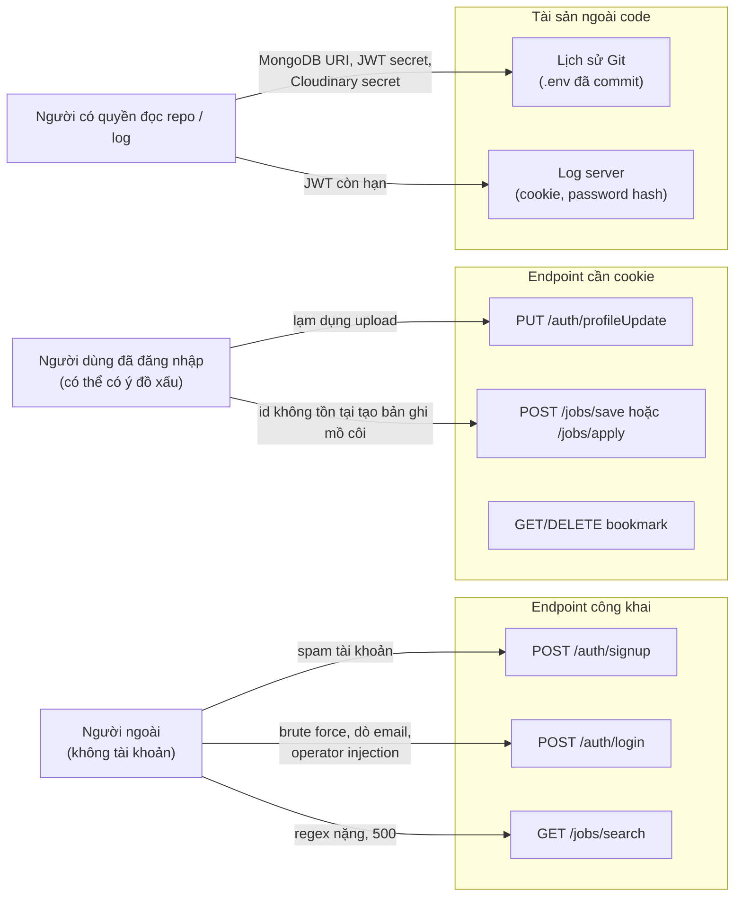
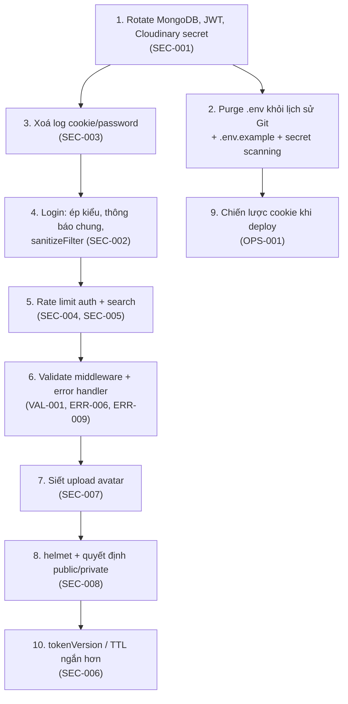

# 08 — Bảo mật và phân quyền

> [← Mục lục](00-MUC-LUC.md) · [← 07 Database](07-DATABASE-VA-TOAN-VEN-DU-LIEU.md) · Tiếp theo: [09 — Hiệu năng →](09-HIEU-NANG-VA-KHA-NANG-MO-RONG.md)

> **Lưu ý khi đọc:** báo cáo mô tả **loại** lỗ hổng và **cách phòng chống**, không cung cấp payload khai thác chi tiết. Không có giá trị secret nào được trích dẫn.

## 1. Bức tranh tổng quan

### 1.1. Đối chiếu OWASP Top 10 (2021)

| OWASP | Hạng mục | Tình trạng trong JobRadar | Mã |
|---|---|---|---|
| A01 | Broken Access Control | 🟢 **Tốt**: mọi truy vấn dữ liệu cá nhân đều lọc theo `userId` từ token. 🟡 `/search` công khai còn `/getjobs` bảo vệ (không nhất quán). | SEC-008 |
| A02 | Cryptographic Failures | 🔴 Secret bị commit; JWT secret ngắn. 🟢 Mật khẩu hash bcrypt. | SEC-001, SEC-006 |
| A03 | Injection | 🟠 NoSQL operator ở login (tiềm ẩn); regex injection ở search. 🟢 Không có XSS sink (`dangerouslySetInnerHTML`, `innerHTML`, `eval`). | SEC-002, SEC-005 |
| A04 | Insecure Design | 🟠 Không có rate limit; hai hệ thống auth không liên thông; thông báo lỗi làm lộ việc email tồn tại hay không. | SEC-004, ARCH-001, SEC-002 |
| A05 | Security Misconfiguration | 🟠 Không có security headers; stack trace có thể lộ; body limit 10MB toàn cục; CORS hard-code. | SEC-008, VAL-001, SEC-007, OPS-001 |
| A06 | Vulnerable & Outdated Components | 🟡 `@clerk/clerk-react` deprecated. ❓ Chưa chạy `pnpm audit` (cần mạng). | DEP-001 |
| A07 | Identification & Authentication Failures | 🟠 Brute force không bị chặn; JWT không thu hồi được; mật khẩu tối thiểu 6 ký tự. | SEC-004, SEC-006 |
| A08 | Software & Data Integrity Failures | 🟡 Không có CI, không có lockfile check; seed phá huỷ dữ liệu. | TEST-001, DB-003 |
| A09 | Security Logging & Monitoring Failures | 🟠 Log token và password hash, nhưng lại **không** log sự kiện bảo mật (đăng nhập thất bại, 401). | SEC-003 |
| A10 | Server-Side Request Forgery | 🟡 `cloudinary.uploader.upload(<chuỗi người dùng>)` chấp nhận URL từ xa (Cloudinary tự fetch) và có thể là đường dẫn file cục bộ (tiềm ẩn). | SEC-007 |

### 1.2. Bề mặt tấn công



**Nhận xét:** các rủi ro lớn nhất **không** nằm trong logic phân quyền (phần này làm tốt), mà nằm ở **quản lý secret**, **vệ sinh log** và **các cửa vào không được kiểm soát** (không validate, không rate limit).

## 2. Authentication (xác thực)

### 2.1. Luồng hiện tại

| Bước | Cài đặt | Đánh giá |
|---|---|---|
| Hash mật khẩu | `bcrypt.genSalt(10)` + `bcrypt.hash` ([authControllers.js:27-28](../backend/src/controllers/authControllers.js#L27-L28)) | 🟢 Đúng. Cost 10 là mức tối thiểu chấp nhận được; có thể tăng lên 12 khi server đủ mạnh. |
| So sánh mật khẩu | `bcrypt.compare` | 🟢 Đúng (so sánh an toàn về thời gian bên trong bcrypt) |
| Chính sách mật khẩu | ≥ 6 ký tự | 🟡 Nên ≥ 8 ký tự (NIST SP 800-63B); không cần ép ký tự đặc biệt |
| Thông báo lỗi login | Phân biệt "email không tồn tại" và "sai mật khẩu" | 🔴 Cho phép dò email (SEC-002) |
| Kiểu dữ liệu đầu vào | Không kiểm tra | 🟠 Operator injection tiềm ẩn (SEC-002) |
| Chống brute force | Không có | 🟠 SEC-004 |
| Phát hành phiên | JWT HS256, payload `{ userId }`, hạn 7 ngày, trong cookie httpOnly | 🟢 Cách lưu token đúng; 🟡 vòng đời token còn yếu (SEC-006) |
| Kiểm tra phiên | Verify JWT **và** truy vấn `User` mỗi request | 🟢 **Điểm cộng**: user bị xoá thì mất quyền ngay, không phải chờ token hết hạn |
| Xử lý token lỗi | Trả 500 | 🟡 ERR-006 |
| Google OAuth (Clerk) | Chỉ có ở frontend | 🔴 Không liên thông backend (ARCH-001) |

### 2.2. So sánh: lưu token ở đâu?

README đã giải thích đúng lý do chọn cookie httpOnly ([README.md:62-63](../README.md#L62-L63)). Bảng dưới giúp học viên thấy **đầy đủ các đánh đổi**:

| Vị trí lưu | XSS đọc được token? | Tự gửi kèm request (nguy cơ CSRF)? | Hoạt động cross-site? |
|---|---|---|---|
| `localStorage` | ❌ Có | Không | Có |
| Cookie httpOnly, `SameSite=Strict` (**hiện tại**) | ✅ Không | Có, nhưng Strict đã chặn cross-site | ❌ **Không**, gây vấn đề khi deploy khác site (OPS-001) |
| Cookie httpOnly, `SameSite=Lax` | ✅ Không | Chặn với POST cross-site | ❌ Không với XHR |
| Cookie httpOnly, `SameSite=None; Secure` | ✅ Không | ⚠️ Có, cần CSRF token | ✅ Có (nhưng có thể bị chặn bởi chính sách cookie bên thứ ba) |

**Kết luận:** lựa chọn hiện tại **đúng về mặt bảo mật**. Muốn giữ được lựa chọn này khi deploy thì frontend và backend phải **cùng site** (xem OPS-001).

## 3. Authorization và RBAC

### 3.1. Kiểm tra quyền sở hữu theo từng endpoint

| Endpoint | Ai được gọi | Kiểm tra quyền sở hữu | Kết quả |
|---|---|---|---|
| `GET /jobs/saved` | Đã đăng nhập | `SaveJob.find({ userId: req.user._id })` | 🟢 Chỉ thấy dữ liệu của mình |
| `GET /jobs/applied` | Đã đăng nhập | `ApplyJob.find({ userId })` | 🟢 |
| `POST /jobs/save/:jobId` | Đã đăng nhập | `userId` lấy từ token, **không** từ body | 🟢 Không tạo được bookmark thay người khác |
| `DELETE /jobs/deleteds/:id` | Đã đăng nhập | `findOneAndDelete({ userId, _id })` | 🟢 **Không có IDOR**: đoán được id của người khác cũng không xoá được |
| `DELETE /jobs/deleteda/:id` | Đã đăng nhập | Như trên | 🟢 |
| `PUT /auth/profileUpdate` | Đã đăng nhập | `findByIdAndUpdate(req.user._id)` | 🟢 Chỉ sửa được hồ sơ của mình |
| `GET /auth/authCheck` | Đã đăng nhập | Trả `req.user` | 🟢 |
| `GET /jobs/getjobs` | Đã đăng nhập | Dữ liệu dùng chung | 🟡 Bảo vệ nhưng không nhất quán với `/search` |
| `GET /jobs/search` | **Bất kỳ ai** | Dữ liệu dùng chung | 🟡 Có thể là chủ ý (trang tìm việc công khai), cần quyết định rõ |

> 🎓 **Đây là phần học viên làm tốt nhất về bảo mật.** Lỗi IDOR (truy cập dữ liệu người khác bằng cách đổi id) là lỗi phổ biến ở dự án của người mới. Việc luôn kết hợp `userId` từ token vào điều kiện truy vấn cho thấy tư duy đúng: **backend là nguồn sự thật về quyền, frontend guard chỉ để trải nghiệm**.

### 3.2. RBAC

- Hiện **không có vai trò** (role) nào. Với chức năng hiện tại, điều này **hợp lý**, vì mọi người dùng có quyền như nhau.
- **Khoảng trống:** không có actor "quản trị dữ liệu job". Muốn thêm, sửa hoặc ẩn một tin tuyển dụng, người vận hành phải **truy cập thẳng vào DB** bằng chuỗi kết nối có toàn quyền. Đây là rủi ro vận hành (thao tác tay, không có audit log) hơn là lỗi code.
- **Khi nào cần RBAC?** Khi có API quản trị job (import dữ liệu thật, ẩn tin vi phạm). Lúc đó một trường `role: "user" | "admin"` cùng middleware `requireRole("admin")` là đủ. **Chưa cần** thư viện phân quyền phức tạp.

## 4. Validation

Tóm tắt từ VAL-001 và các mục liên quan:

| Lớp | Có validate? | Ghi chú |
|---|---|---|
| Frontend form | 🟡 Một phần | Kiểm tra rỗng, định dạng email, độ dài mật khẩu; LogInPage lỗi import `toast`. Validate phía client **chỉ để trải nghiệm**, không phải để bảo mật. |
| Backend: kiểu dữ liệu | ❌ | Không kiểm tra `typeof`, cho phép object hoặc number đi vào query và bcrypt |
| Backend: định dạng | 🟡 | Email regex ở signup; không kiểm tra ObjectId, data URI, `page` |
| Backend: giới hạn | ❌ | Không giới hạn độ dài chuỗi, số phần tử mảng query |
| Schema Mongoose | 🟡 | Tốt cho `Job` (enum, required); yếu cho `User` |

**Nguyên tắc:** validate tại **ranh giới tin cậy** (trust boundary), tức ngay khi dữ liệu vào backend, theo kiểu **whitelist** (chỉ chấp nhận cái được định nghĩa), rồi mới chuyển cho logic nghiệp vụ.

## 5. Secret và biến môi trường

| Vấn đề | Chi tiết | Mã |
|---|---|---|
| 🔴 Secret trong lịch sử Git | `backend/.env` (MongoDB URI có credentials, JWT secret, Cloudinary secret) nằm trong commit `f7e88b3`, đã có trên `origin/main` | SEC-001 |
| 🟡 Không có `.env.example` | Người mới không biết cần biến gì, dễ copy `.env` thật đi khắp nơi | OPS-002 |
| 🟡 Không validate khi khởi động | Thiếu `JWT_SECRET` thì crash muộn (ERR-007). Thiếu `CLOUD_*` thì chỉ lỗi khi upload. | ERR-007 |
| 🟡 JWT secret yếu | Secret từng commit rất ngắn | SEC-006 |
| ℹ️ Biến frontend | `VITE_CLERK_PUBLISHABLE_KEY` là khoá **công khai theo thiết kế**, không phải secret | — |

> ⚠️ **Kiến thức quan trọng về Vite:** mọi biến `VITE_*` được **nhúng thẳng vào bundle JavaScript** gửi xuống trình duyệt, ai cũng đọc được. **Tuyệt đối không** đặt secret (API secret, DB URI…) vào biến `VITE_*`.

## 6. Session, cookie, token

### 6.1. Thuộc tính cookie `token`

| Thuộc tính | Giá trị ([generateToken.js:11-16](../backend/src/utils/generateToken.js#L11-L16)) | Đánh giá |
|---|---|---|
| `httpOnly` | `true` | 🟢 JavaScript không đọc được, giảm tác hại của XSS |
| `sameSite` | `"strict"` | 🟢 Chống CSRF tốt; 🟠 không tương thích deploy khác site |
| `secure` | `NODE_ENV !== "development"` | 🟡 Đúng ý tưởng. Nhưng nếu chạy local mà **không** đặt `NODE_ENV`, cookie sẽ có `Secure` trên `http://localhost`. Chrome/Firefox chấp nhận cho localhost, còn một số trình duyệt khác có thể không, dẫn tới lỗi "đăng nhập xong vẫn bị đá ra" khó hiểu (rủi ro tiềm ẩn, độ chắc chắn Trung bình). |
| `maxAge` | 7 ngày | 🟡 Khớp với `expiresIn: "7d"` nhưng hai giá trị viết riêng rẽ |
| `path` / `domain` | Mặc định | 🟢 |
| Xoá khi logout | `res.cookie("token", "", { maxAge: 0 })` | 🟡 Hoạt động (cùng name và path), nhưng nên dùng `clearCookie` với **cùng tuỳ chọn** như lúc tạo |

### 6.2. JWT

| Khía cạnh | Hiện trạng | Đánh giá |
|---|---|---|
| Thuật toán | HS256 (mặc định của `jsonwebtoken`) | 🟢 Phù hợp khi chỉ một backend ký và xác minh |
| Payload | `{ userId, iat, exp }` | 🟢 Tối giản, không chứa dữ liệu nhạy cảm |
| Hạn | 7 ngày | 🟡 Dài, không có refresh |
| Thu hồi | Không | 🟡 SEC-006 |
| Secret | Từng rất ngắn và đã lộ | 🔴 SEC-001, SEC-006 |
| Xử lý hết hạn | Trả 500 | 🟡 ERR-006 |

### 6.3. CSRF

Với cấu hình hiện tại (`SameSite=Strict`, API nhận JSON, CORS chỉ cho phép một origin cụ thể kèm `credentials: true`), **nguy cơ CSRF thấp**. Đây là hệ quả tốt của lựa chọn cookie. Nếu sau này chuyển sang `SameSite=None` để deploy khác site, **bắt buộc** phải bổ sung CSRF token hoặc kiểm tra header `Origin`.

## 7. Upload, CORS, rate limit, injection

### 7.1. Upload

Xem SEC-007. Tóm tắt các lớp kiểm soát còn thiếu:

| Lớp kiểm soát | Có? |
|---|---|
| Giới hạn kích thước ở client | ❌ |
| Giới hạn kích thước riêng cho route upload | ❌ (10MB cho **mọi** route) |
| Kiểm tra MIME/định dạng ở server | ❌ |
| Chỉ chấp nhận data URI (không nhận URL/đường dẫn) | ❌ |
| Giới hạn tần suất upload | ❌ |
| Ghi đè hoặc xoá ảnh cũ | ❌ |
| Resize/transform ảnh | ❌ |

### 7.2. CORS

```js
cors({ origin: "http://localhost:5173", credentials: true })   // index.js:11-14
```

- 🟢 **Đúng nguyên tắc**: origin cụ thể, không dùng `"*"` cùng `credentials: true` (trình duyệt vốn cũng cấm tổ hợp này).
- 🟠 Hard-code nên không deploy được (OPS-001). Nên đọc từ biến môi trường, có thể là danh sách nhiều origin (preview và production).

### 7.3. Rate limit

**Không có ở bất kỳ endpoint nào** (SEC-004). Mức tối thiểu nên có:

| Endpoint | Gợi ý |
|---|---|
| `POST /auth/login` | ~10 lần / 15 phút / IP (nâng cao: theo IP + email) |
| `POST /auth/signup` | ~5 lần / giờ / IP |
| `PUT /auth/profileUpdate` | ~10 lần / giờ / user |
| `GET /jobs/search` | ~60 lần / phút / IP |

Khi scale ngang nhiều instance, bộ đếm cần lưu ở nơi dùng chung (ví dụ Redis). **Hiện tại chưa cần**, bộ nhớ trong tiến trình là đủ.

### 7.4. Injection

| Loại | Vị trí | Tình trạng |
|---|---|---|
| NoSQL operator injection | `User.findOne({ email })` với `email` từ JSON body | ⚠️ Tiềm ẩn (SEC-002) |
| Regex injection | `new RegExp(<city/region>)` | ✅ Xác nhận gây 500; ⚠️ tiềm ẩn gây tốn CPU (SEC-005) |
| Query string operator injection | `req.query` | 🟢 Express 5 dùng parser "simple", **không** tạo object lồng nhau, nên query string không mang toán tử `$` được. Đây là điểm cộng của Express 5 (dù cũng chính điều này làm salary filter chết, BIZ-001). |
| XSS | React JSX | 🟢 React tự escape; không có `dangerouslySetInnerHTML`. ℹ️ `href={sourceUrl}` lấy từ DB: hiện dữ liệu chỉ đến từ seed nên an toàn. Khi tích hợp dữ liệu thật, cần validate `sourceUrl` bắt đầu bằng `http(s)://` lúc nạp. |
| Command / path injection | — | 🟢 Không có `child_process`, không đọc file theo input (ngoại trừ rủi ro gián tiếp qua SDK Cloudinary ở SEC-007) |

## 8. Khả năng truy cập trái phép hoặc lộ dữ liệu

| # | Kịch bản | Điều kiện | Dữ liệu bị ảnh hưởng | Khả năng xảy ra | Mã |
|---|---|---|---|---|---|
| 1 | Dùng secret trong lịch sử Git để truy cập DB hoặc tự ký JWT | Đọc được repo; secret chưa rotate | **Toàn bộ** | Cao nếu repo public | SEC-001 |
| 2 | Lấy JWT từ log hosting | Có quyền xem log | Phiên của người dùng bất kỳ (≤ 7 ngày) | Trung bình | SEC-003 |
| 3 | Dò hoặc trích xuất email người dùng | Không cần gì | Danh sách email | Cao (dò) / Trung bình (trích xuất) | SEC-002 |
| 4 | Brute force mật khẩu | Không cần gì | Tài khoản có mật khẩu yếu | Trung bình | SEC-004 |
| 5 | Xem stack trace nội bộ | Gửi request thiếu body | Đường dẫn file, phiên bản thư viện | Trung bình (khi không phải production) | VAL-001 |
| 6 | Truy cập dữ liệu saved/applied của người khác | — | — | 🟢 **Không khả thi** với code hiện tại | — |
| 7 | Dữ liệu cá nhân trong console trình duyệt | Truy cập vật lý hoặc extension | `authUser` (email, tên) | Thấp | CODE-004 |
| 8 | Lộ IP/Referer người dùng cho website bên thứ ba | Mở trang Profile khi chưa có avatar | IP, trang đang xem | Cao (tự động), tác hại thấp | SEC-009 |

## 9. Kế hoạch tăng cường bảo mật theo thứ tự



## 10. Checklist bảo mật cho học viên

**Secret & cấu hình**
- [ ] Không có file `.env` nào trong `git log --all`
- [ ] Có `.env.example`, không có giá trị thật
- [ ] Không biến `VITE_*` nào chứa secret
- [ ] Secret JWT ≥ 32 byte ngẫu nhiên

**Xác thực & phiên**
- [ ] Login trả một thông báo chung cho mọi lỗi thông tin đăng nhập
- [ ] Có rate limit cho login/signup
- [ ] Token lỗi hoặc hết hạn trả 401
- [ ] Logout xoá cookie với đúng tuỳ chọn; có cách thu hồi token nếu cần

**Đầu vào**
- [ ] Mọi `req.body`, `req.params`, `req.query` được validate kiểu và giới hạn
- [ ] Không đưa input thô vào `RegExp` hay filter MongoDB
- [ ] Upload giới hạn loại, kích thước, tần suất

**Đầu ra & log**
- [ ] Không log cookie, token, password (kể cả hash)
- [ ] Không trả stack trace ra client
- [ ] Có log sự kiện bảo mật (đăng nhập thất bại nhiều lần)
