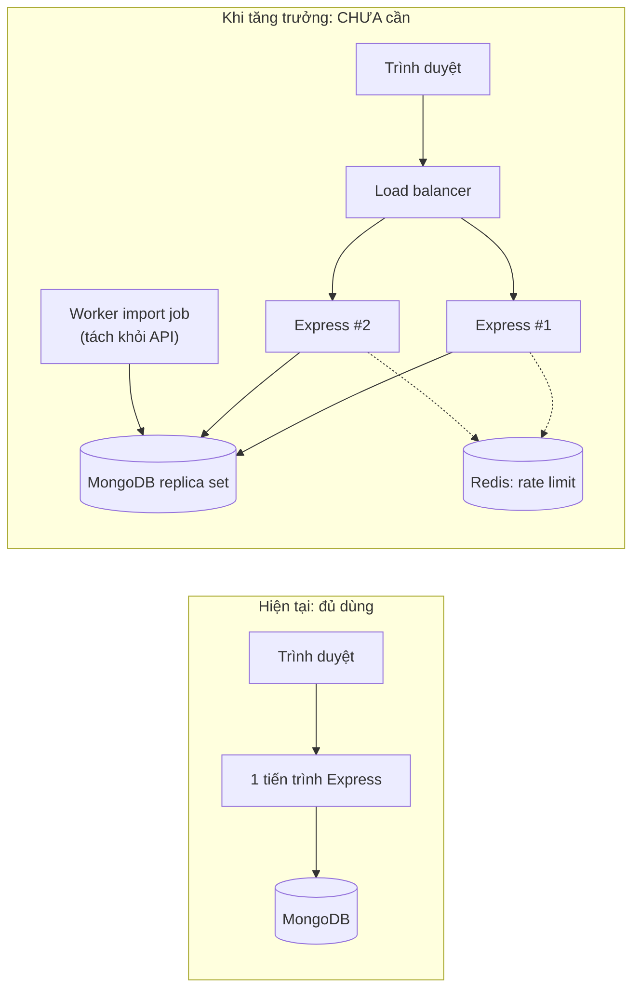

# 09 — Hiệu năng và khả năng mở rộng

> [← Mục lục](00-MUC-LUC.md) · [← 08 Bảo mật](08-BAO-MAT-VA-PHAN-QUYEN.md) · Tiếp theo: [10 — Kiểm thử →](10-KIEM-THU-VA-DO-TIN-CAY.md)

## 0. Bối cảnh trước khi nói về hiệu năng

| Thông số | Giá trị |
|---|---|
| Số job trong dữ liệu | 5 (seed) |
| Số người dùng | ❓ Chưa đủ dữ liệu (chưa deploy) |
| Số liệu đo (load test, APM, `explain()`) | **Không có** |
| Môi trường | Máy cá nhân |

> **Nguyên tắc:** *"Đo trước khi tối ưu."* Ở quy mô hiện tại, **không có vấn đề hiệu năng nào đo được**. Phần này có hai mục đích: (1) chỉ ra những thiết kế **sẽ** thành điểm nghẽn khi có dữ liệu thật, để tránh xây tiếp lên nền sai; (2) ghi rõ những tối ưu **chưa nên làm**, để tránh tốn công vô ích.

## 1. Phân tích truy vấn và API

| Endpoint | Số truy vấn DB | Index được dùng | Kích thước response | Chi phí tăng theo | Vấn đề khi dữ liệu lớn |
|---|---|---|---|---|---|
| *(mọi route bảo vệ)* | +1 `User.findById` | `_id` ✅ | — | O(1) | Không đáng lo. Đây là cái giá hợp lý để thu hồi quyền tức thì. |
| `GET /auth/authCheck` | 1 | `_id` ✅ | Nhỏ | O(1) | — |
| `POST /auth/login` | 1 + bcrypt | `email` ✅ | Nhỏ | CPU bcrypt (~cost 10) | bcryptjs là JS thuần, tốn CPU của tiến trình Node; login dồn dập sẽ làm chậm các request khác (liên quan SEC-004) |
| `GET /jobs/getjobs` | 1 `find()` | Không (không filter) | **Toàn bộ job, cả `description` dài** | O(N) payload + O(N) render | Với 10.000 job × ~1KB mô tả, payload vượt 10MB và trình duyệt render 10.000 card |
| `GET /jobs/search` | 2 (`countDocuments` + `find`) | Chỉ khi có `jobType` (tiền tố compound index); regex city/region **không seek** được | ≤ 10 job | O(N) quét + O(skip) | Không có filter thì quét toàn collection và sort `expiredAt` trong bộ nhớ, **2 lần** (count + find) |
| `GET /jobs/saved` / `applied` | 2 (find + populate `$in`) | **Không** cho `userId` | Toàn bộ bookmark + job đầy đủ | O(tổng số bookmark của mọi user) | Quét toàn bộ `savejobs` dù chỉ lấy của một user |
| `POST /jobs/save/:id`, `/jobs/apply/:id` | 2 (`findOne` + `create`) | **Không** | Nhỏ | O(tổng bookmark) | Như trên |
| `DELETE /jobs/deleted*/:id` | 2 (`findOne` + `findOneAndDelete`) | `_id` ✅ | Nhỏ | O(1) | Thừa một truy vấn (không đáng kể) |
| `PUT /auth/profileUpdate` | 1 + upload Cloudinary | `_id` ✅ | Nhỏ | Mạng (hàng trăm ms đến vài giây) + parse JSON tới 10MB | Parse JSON lớn là thao tác đồng bộ, **chặn event loop** trong lúc parse |

### 1.1. Không có N+1

Học viên dùng `populate` thay vì vòng lặp gọi `Job.findById` cho từng bookmark. Mongoose gom các id lại thành **một** truy vấn `$in`, nên **không mắc lỗi N+1**, một lỗi rất phổ biến ở người mới. Đây là điểm tốt cần ghi nhận.

### 1.2. Phân trang bằng `skip`

`skip((page - 1) * 10)` buộc MongoDB đọc qua rồi bỏ đi các document trước đó, chi phí tăng tuyến tính theo số trang. **Ở quy mô dưới vài chục nghìn job, cách này hoàn toàn chấp nhận được.** Chỉ cân nhắc cursor-based pagination (`expiredAt` + `_id`) khi có số liệu cho thấy trang sâu bị chậm.

### 1.3. Regex và index

```js
new RegExp("Ha\\s*Noi", "i")   // không neo ^, không phân biệt hoa thường
```

MongoDB chỉ dùng index hiệu quả cho regex **có neo đầu `^` và phân biệt hoa thường**. Với dạng trên, planner phải quét toàn bộ index hoặc toàn bộ collection. Cách tốt hơn **về cả hiệu năng lẫn bảo mật** (SEC-005) là chuẩn hoá giá trị khi lưu (ví dụ `citySlug: "ha-noi"`) rồi so khớp chính xác bằng `$in`.

## 2. Xử lý dữ liệu ở frontend

| Vấn đề | Bằng chứng | Ảnh hưởng hiện tại | Khi dữ liệu lớn |
|---|---|---|---|
| Gọi lại `getJobs()` mỗi lần vào trang chủ | [HomePage.jsx:11-13](../frontend/src/Pages/HomePage.jsx#L11-L13) | Không đáng kể | Tải lại toàn bộ job mỗi lần điều hướng; mất kết quả lọc |
| Gọi store **không có selector** | `const { ... } = jobsStore()` ở JobCard, JobsList, 4 header, 3 page | Không đáng kể | Mỗi lần `savingJobId` đổi, **mọi JobCard** re-render |
| Render toàn bộ danh sách | [JobsList.jsx:11-13](../frontend/src/components/JobsList.jsx#L11-L13) | Không đáng kể | Hàng nghìn card, DOM nặng. Giải pháp đúng là **phân trang ở server**, chưa cần virtualization. |
| Ảnh base64 qua JSON | [ProfilePage.jsx:9-18](../frontend/src/Pages/ProfilePage.jsx#L9-L18) | Ảnh 5MB thành chuỗi ~6,7MB giữ trong bộ nhớ trình duyệt, rồi gửi qua mạng, rồi parse ở server | Tốn băng thông, tốn RAM server |
| `console.log` trong render | [App.jsx:19, 24](../frontend/src/App.jsx#L19-L24), [JobsList.jsx:7](../frontend/src/components/JobsList.jsx#L7) | Không đáng kể | Log object lớn trong DevTools làm chậm khi mở console |
| `StrictMode` gọi effect 2 lần | [main.jsx:11](../frontend/src/main.jsx#L11) | Chỉ ở môi trường dev (gọi API 2 lần) | Không ảnh hưởng production. **Đây là hành vi đúng**, không phải lỗi. |

**Ví dụ dùng selector trong Zustand:**

```js
// Thay vì lấy cả store:
const { savingJobId, saveJob } = jobsStore();
// Chỉ subscribe phần cần, và component chỉ re-render khi phần đó đổi:
const isSaving = jobsStore((s) => s.savingJobId === jobId);
const saveJob  = jobsStore((s) => s.saveJob);
```

## 3. Cache, queue và background job

| Thành phần | Hiện trạng | Có cần bây giờ? | Khi nào cần |
|---|---|---|---|
| Cache ứng dụng (Redis, in-memory) | Không có | ❌ Không | Khi `explain()` cho thấy truy vấn danh sách job chậm **và** dữ liệu ít thay đổi |
| HTTP cache (`Cache-Control`, `ETag`) | Không có | ❌ Không | Khi `/search` công khai có lưu lượng lớn |
| Queue (BullMQ, RabbitMQ) | Không có | ❌ Không | Khi có tác vụ dài: thu thập job từ API ngoài, gửi email nhắc hạn (Roadmap) |
| Background job / cron | `node-cron` **cài nhưng không dùng** | ❌ Không (xem BIZ-005: lọc hết hạn bằng truy vấn là đủ) | Khi tích hợp nguồn job thật: job định kỳ kéo dữ liệu, upsert theo `sourceUrl` |
| Upload bất đồng bộ | Upload đồng bộ trong request | ❌ Không | Khi có xử lý ảnh nặng. Nên ưu tiên *signed upload* thẳng từ trình duyệt hơn là queue. |

### Về `node-cron` khi có job thật

Nếu dùng `node-cron` **bên trong tiến trình API** và scale ra nhiều instance, **mỗi instance đều chạy cron**, và job import sẽ chạy trùng N lần. Khi đó cần tách worker riêng, dùng scheduler của nền tảng (Render Cron Job), hoặc có cơ chế khoá. Đây là ví dụ điển hình về việc **một quyết định đơn giản ở quy mô nhỏ trở thành lỗi khi scale ngang**.

## 4. Khả năng chịu tải

> ❓ **Chưa đủ dữ liệu để đưa ra con số.** Không có load test, không có cấu hình hosting cụ thể. Phần dưới là đánh giá định tính.

| Loại tải | Thành phần chịu ảnh hưởng đầu tiên | Lý do |
|---|---|---|
| Nhiều người đăng nhập cùng lúc | CPU tiến trình Node | bcrypt tốn CPU; không có rate limit để chặn tải bất thường |
| Nhiều người dùng duyệt trang chủ | Băng thông + MongoDB | `/getjobs` trả toàn bộ collection |
| Tìm kiếm với nhiều bộ lọc | MongoDB CPU | Regex quét toàn bộ; `countDocuments` + `find` lặp lại quá trình quét |
| Upload avatar đồng thời | RAM + event loop Node | JSON 10MB parse đồng bộ |
| Dữ liệu bookmark tăng | MongoDB | `find({ userId })` không có index |
| MongoDB tạm mất kết nối | Toàn bộ API | Mongoose buffer lệnh rồi timeout, trả 500. Không có health check để nền tảng tự restart hoặc điều hướng lưu lượng. |

## 5. Điểm nghẽn, xếp theo thời điểm sẽ gặp

| Thứ tự | Điểm nghẽn | Gặp khi nào | Giải pháp đơn giản nhất | Mã |
|---|---|---|---|---|
| 1 | `/getjobs` trả toàn bộ job | Vài trăm job trở lên | Phân trang + projection (bỏ `description` ở danh sách) | BIZ-006, PERF-001 |
| 2 | `savejobs`/`applyjobs` không có index | Vài chục nghìn bookmark | Unique compound index `{ userId, jobId }` | DB-002 |
| 3 | Regex city/region | Vài nghìn job | So khớp chính xác giá trị chuẩn hoá | SEC-005 |
| 4 | Body JSON 10MB cho mọi route | Có người gửi request lớn (cố ý hoặc không) | Limit 100kb mặc định; route upload riêng | SEC-007 |
| 5 | bcrypt khi bị brute force | Bị tấn công | Rate limit | SEC-004 |
| 6 | Sort `expiredAt` không có index | Vài chục nghìn job | Index `{ isActive: 1, expiredAt: 1 }` | — |
| 7 | Re-render toàn store | Hàng trăm card trên một trang | Selector Zustand | PERF-001 |

## 6. Khả năng scale dọc và scale ngang

### 6.1. Scale dọc (tăng CPU/RAM cho một máy)

- ✅ Không có rào cản kỹ thuật. Đây là **lựa chọn đúng cho giai đoạn đầu**: đơn giản, không phải sửa code.
- Giới hạn: Node chạy một luồng JavaScript, nên thêm nhân CPU không giúp gì nếu không chạy nhiều tiến trình.

### 6.2. Scale ngang (nhiều instance sau load balancer)

| Yếu tố | Sẵn sàng? | Ghi chú |
|---|---|---|
| Phiên đăng nhập | ✅ | JWT stateless trong cookie, không có session in-memory |
| State trong tiến trình | ✅ | Không có biến toàn cục lưu dữ liệu người dùng |
| File tạm trên đĩa | ✅ | Ảnh gửi thẳng lên Cloudinary |
| Rate limit (khi thêm) | ⚠️ | Bộ đếm in-memory sẽ tách rời theo instance, cần store dùng chung |
| Cron (nếu dùng `node-cron` trong API) | ⚠️ | Chạy trùng trên mọi instance |
| Tạo index lúc khởi động (`autoIndex`) | ⚠️ | Nhiều instance cùng yêu cầu tạo index; nên tạo bằng script riêng |
| Health check endpoint | ❌ | Load balancer không biết instance nào khoẻ |
| Graceful shutdown | ❌ | Không xử lý `SIGTERM`, nên request đang chạy bị cắt khi deploy |
| Cấu hình | ❌ | Hard-code localhost (OPS-001) |



**Kết luận:** kiến trúc hiện tại **về nguyên tắc đã sẵn sàng scale ngang** nhờ JWT stateless. Đây là một hệ quả tốt của quyết định thiết kế ban đầu. Những gì còn thiếu (health check, cấu hình môi trường, graceful shutdown) đều là việc nhỏ.

## 7. Những tối ưu **chưa cần thiết** ở quy mô hiện tại

| Tối ưu | Vì sao chưa nên làm |
|---|---|
| Thêm Redis cache | Chưa có truy vấn chậm nào được đo; cache làm phát sinh bài toán invalidation |
| Message queue | Chưa có tác vụ dài |
| Tách microservice (auth service, job service) | ~800 dòng backend; chi phí vận hành lớn hơn nhiều so với lợi ích |
| Elasticsearch / Atlas Search | Chưa có tìm kiếm theo từ khoá; MongoDB text index đủ cho giai đoạn đầu |
| Cursor-based pagination | `skip` ổn tới vài chục nghìn document |
| Virtualized list (react-window) | Phân trang ở server đã giải quyết gốc vấn đề |
| `React.memo`/`useMemo` khắp nơi | Dùng selector Zustand trước; chỉ memo khi profiler chỉ ra điểm chậm |
| Chuyển sang Next.js/SSR để "nhanh hơn" | Không giải quyết vấn đề nào đang có; tăng độ phức tạp deploy |
| Sharding MongoDB | Chỉ cần ở quy mô hàng trăm GB trở lên |
| Thêm index cho mọi trường của `jobs` | Hiện đã **thừa** index (4/5 index tự định nghĩa không được dùng) |

## 8. Kế hoạch theo ngưỡng dữ liệu

| Ngưỡng | Việc nên làm |
|---|---|
| **Bây giờ** (dữ liệu mẫu) | Phân trang cho danh sách; unique index bookmark; lọc hết hạn trong truy vấn; body limit hợp lý. Làm vì **đúng nghiệp vụ và bảo mật**, không phải vì hiệu năng. |
| **~1.000 job thật / vài trăm user** | Projection cho danh sách; chuẩn hoá city/region; selector Zustand; đo bằng `explain("executionStats")` |
| **~50.000 job / vài nghìn user** | Index theo truy vấn thực tế (`isActive + expiredAt`, các filter phổ biến); worker import job riêng; health check + 2 instance |
| **Lớn hơn** | Cân nhắc cache danh sách, Atlas Search, cursor pagination. Quyết định **dựa trên số đo**. |
