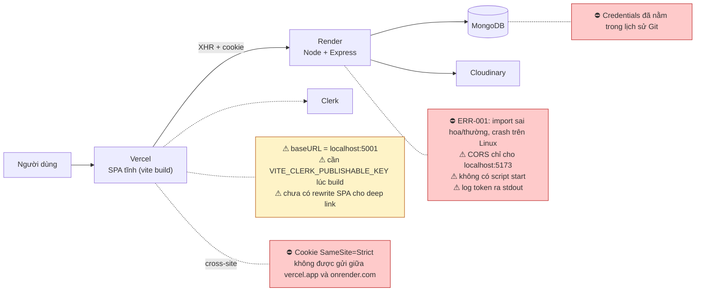
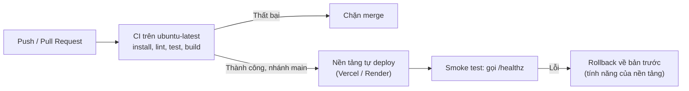

# 11 — Triển khai và vận hành

> [← Mục lục](00-MUC-LUC.md) · [← 10 Kiểm thử](10-KIEM-THU-VA-DO-TIN-CAY.md) · Tiếp theo: [12 — Lộ trình cải thiện →](12-LO-TRINH-CAI-THIEN.md)

## 1. Hiện trạng tổng quan

| Hạng mục | Có trong repo? | Ghi chú |
|---|---|---|
| Dockerfile / docker-compose | ❌ | — |
| Cấu hình nền tảng (`vercel.json`, `render.yaml`) | ❌ | README chỉ nhắc Render và Vercel ở mục Tools |
| CI/CD pipeline | ❌ | — |
| Reverse proxy (Nginx…) | ❌ | Chưa cần nếu dùng PaaS |
| Script `start` (backend) | ❌ | Chỉ có `dev` với nodemon |
| `.env.example` | ❌ | — |
| Health check endpoint | ❌ | — |
| Logging có cấu trúc | ❌ | `console.*` |
| Error tracking / monitoring / alert | ❌ | — |
| Tài liệu backup / restore | ❌ | — |
| Tag / release / changelog | ❌ | 6 commit, không có tag |
| Trạng thái deploy thực tế | ❓ | Roadmap ghi "Deploy to production" **chưa hoàn thành** ([README.md:94](../README.md#L94)) |

**Kết luận:** dự án **chưa sẵn sàng deploy**. Có 2 lỗi chặn hoàn toàn (ERR-001, OPS-001) và 1 lỗi phải xử lý trước bất kỳ lần deploy nào (SEC-001).

## 2. Kiến trúc triển khai dự kiến và các điểm vỡ

## 3. Build và deploy

### 3.1. Frontend

| Bước | Hiện trạng | Vấn đề / rủi ro |
|---|---|---|
| Build | `vite build` ([package.json:8](../frontend/package.json#L8)) | ❓ Chưa chạy được để xác nhận build thành công (DEP-001: daisyUI 5 với Tailwind 3) |
| URL API | Hard-code `http://localhost:5001/api` | ⛔ Bản production gọi về máy của người dùng (OPS-001) |
| Biến môi trường lúc build | `VITE_CLERK_PUBLISHABLE_KEY` được **nhúng vào bundle khi build** | Thiếu biến trên nền tảng build thì app trắng trang (ARCH-001). Đổi biến phải **build lại**, không chỉ restart. |
| Routing SPA | `BrowserRouter` | ⚠️ **Rủi ro tiềm ẩn:** trên hosting tĩnh, truy cập thẳng `/savedJobs` hoặc F5 ở trang con cần rewrite mọi đường dẫn về `index.html`. Repo chưa có cấu hình này, nên có khả năng trả 404. Độ chắc chắn: Trung bình, vì còn tuỳ preset của nền tảng. |
| Metadata | `<title>frontend</title>`, favicon trỏ file không tồn tại | CODE-003 |

### 3.2. Backend

| Bước | Hiện trạng | Vấn đề / rủi ro |
|---|---|---|
| Cài đặt | `pnpm install` với `packageManager: pnpm@9.15.2` | 🟢 Có lockfile, có khai báo package manager (**tốt**) |
| Lệnh chạy | Không có `start`; `dev` dùng `nodemon` | Phải tự cấu hình `node src/index.js` trên nền tảng (OPS-002) |
| Khởi động | ⛔ Crash trên Linux vì ERR-001 | Chặn deploy |
| Cổng | `process.env.PORT \|\| 5001` | 🟢 Đúng chuẩn PaaS |
| Node version | Không khai báo `engines` | Nền tảng có thể chọn phiên bản khác với máy dev |
| Kết nối DB | Listen trước rồi mới connect | Nhận request khi DB chưa sẵn sàng (ERR-007) |
| Tắt tiến trình | Không xử lý `SIGTERM` | Request đang chạy bị cắt khi redeploy |
| Tạo index | `autoIndex` mặc định | Ổn ở quy mô nhỏ |

## 4. CI/CD

**Hiện trạng:** không có. Mọi kiểm tra dựa vào máy của tác giả (macOS), nên ERR-001 không thể bị phát hiện trước khi deploy.

**Đề xuất tối thiểu, phù hợp dự án cá nhân:**

- CI: xem file mẫu ở [10 §4.6](10-KIEM-THU-VA-DO-TIN-CAY.md).
- CD: dùng auto-deploy của Vercel/Render từ nhánh `main`. **Không cần** tự viết pipeline deploy.
- Bật *branch protection*: chỉ merge vào `main` khi CI xanh.
- Bật *preview deployment* cho Pull Request (Vercel có sẵn) để kiểm tra trước khi merge. Lưu ý: CORS phải chấp nhận domain preview.

## 5. Logging, monitoring và alert

### 5.1. Logging hiện tại

| Đặc điểm | Hiện trạng | Vấn đề |
|---|---|---|
| Công cụ | `console.log` / `console.error` | Không có cấp độ, không có cấu trúc JSON, khó lọc |
| Nội dung | Cookie (JWT), document user có password hash, toàn bộ saved jobs, query string | 🔴 **Log dữ liệu nhạy cảm** (SEC-003) |
| Log lỗi | Chỉ `error.message` | Mất stack trace, khó tìm nguyên nhân |
| Access log | Không có | Không biết request nào tới, mất bao lâu, trả mã gì |
| Correlation / request id | Không có | Không nối được log giữa các bước của cùng một request |
| Sự kiện bảo mật | Không log đăng nhập thất bại | Không phát hiện được brute force |

**Nghịch lý cần chú ý:** hệ thống đang log **quá nhiều thứ không nên log** (token, hash), nhưng lại **không log những thứ cần** (stack trace, access log, sự kiện bảo mật).

### 5.2. Đề xuất vừa sức

| Mức | Việc | Công cụ gợi ý |
|---|---|---|
| 1 | Xoá log nhạy cảm; log lỗi 5xx kèm stack | — |
| 2 | Access log dạng JSON có redact | `pino` + `pino-http` (`redact: ["req.headers.cookie"]`) |
| 3 | Theo dõi lỗi cho cả FE và BE | Sentry (có gói miễn phí) |
| 4 | Endpoint `/healthz` (kiểm tra kết nối DB) + uptime monitor | Health check của nền tảng, UptimeRobot hoặc tương tự |
| 5 | Alert qua email khi downtime hoặc lỗi 5xx tăng đột biến | Tính năng alert của công cụ ở mức 3–4 |

**Chưa cần:** Prometheus/Grafana, ELK stack, distributed tracing.

## 6. Backup và restore

| Dữ liệu | Nơi lưu | Backup hiện tại | Rủi ro |
|---|---|---|---|
| Users, bookmarks | MongoDB | ❓ **Chưa đủ dữ liệu**: repo không có script hay tài liệu. Tuỳ nhà cung cấp và gói dịch vụ, backup tự động có thể có hoặc không. | Mất dữ liệu người dùng không khôi phục được |
| Jobs | MongoDB + [seed](../backend/seeds/jobs.seeds.js) | Seed có thể tạo lại **nội dung**, nhưng **không giữ `_id`** | Seed lại sẽ làm mồ côi bookmark (DB-001) |
| Ảnh đại diện | Cloudinary | Theo chính sách của Cloudinary | Thấp |
| Secret | File `.env` cục bộ | Không có kho quản lý secret | Mất máy thì mất cấu hình; đã lộ qua Git |

**Đề xuất:**

1. Xác định nhà cung cấp và gói MongoDB đang dùng có backup tự động hay không. Nếu không, lập lịch `mongodump` (ví dụ hằng ngày) ra nơi lưu trữ riêng.
2. **Thử restore ít nhất một lần** vào DB tạm. Backup chưa từng được thử restore thì chưa thể coi là backup.
3. **Vì SEC-001:** trước khi deploy, kiểm tra DB hiện tại có dấu hiệu bị truy cập hoặc sửa đổi bất thường hay không (user lạ, dữ liệu bị xoá). Nếu nghi ngờ, tạo DB mới sạch.
4. Tách DB **dev** và **production**. Không chạy seed trên production (DB-003).

## 7. Quản lý cấu hình môi trường

### 7.1. Danh mục biến môi trường (suy ra từ code)

| Biến | Nơi dùng | Bắt buộc | Là secret? | Ghi chú |
|---|---|---|---|---|
| `PORT` | [index.js:22](../backend/src/index.js#L22) | Không (mặc định 5001) | Không | PaaS tự cấp |
| `MONGOO_URI` | [connectDB.js:8](../backend/src/utils/connectDB.js#L8) | **Có** | **Có** | Tên lạ, nên đổi thành `MONGODB_URI` |
| `JWT_SECRET` | [generateToken.js:7](../backend/src/utils/generateToken.js#L7), [protectRouter.js:15](../backend/src/utils/protectRouter.js#L15) | **Có** | **Có** | ≥ 32 byte ngẫu nhiên |
| `NODE_ENV` | [generateToken.js:15](../backend/src/utils/generateToken.js#L15) | Nên có | Không | Ảnh hưởng cờ `secure` của cookie **và** việc Express có hiện stack trace hay không |
| `CLOUD_NAME` | [cloudinary.js:5](../backend/src/utils/cloudinary.js#L5) | Có (cho upload) | Không | |
| `CLOUD_API_KEY` | [cloudinary.js:6](../backend/src/utils/cloudinary.js#L6) | Có (cho upload) | Nhạy cảm vừa | |
| `CLOUD_API_SECRET` | [cloudinary.js:7](../backend/src/utils/cloudinary.js#L7) | Có (cho upload) | **Có** | |
| `VITE_CLERK_PUBLISHABLE_KEY` | [main.jsx:8](../frontend/src/main.jsx#L8) | **Có** (nếu thiếu thì app crash) | Không (công khai) | Nhúng lúc build |
| *(thiếu)* `CLIENT_URL` | — | Nên có | Không | Cho CORS (OPS-001) |
| *(thiếu)* `VITE_API_URL` | — | Nên có | Không | Cho axios (OPS-001) |

### 7.2. Nguyên tắc (theo tinh thần 12-Factor App)

- **Code giống nhau ở mọi môi trường**, chỉ cấu hình khác nhau.
- **Secret chỉ nằm trong biến môi trường của nền tảng**, không nằm trong Git.
- **Kiểm tra cấu hình khi khởi động**: thiếu biến thì dừng ngay với thông báo rõ ràng, đừng để crash muộn.
- `NODE_ENV=production` ở production. Việc này **bắt buộc** để Express không trả stack trace và để cookie có `Secure`.

## 8. Rollback

| Khía cạnh | Hiện trạng | Đánh giá |
|---|---|---|
| Rollback code | Không có tag/release. Vercel và Render có tính năng quay về bản deploy trước, nhưng repo không ghi quy trình. | ❓ Chưa đủ dữ liệu về cấu hình thực tế |
| Rollback dữ liệu | Không có migration, seed phá huỷ | 🔴 **Rollback code không rollback được dữ liệu.** Nếu một bản deploy lỗi đã ghi dữ liệu sai hoặc seed đã xoá job, quay lại code cũ cũng không khôi phục được. |
| Tương thích ngược | Không có quy ước | Ví dụ: đổi shape response của `/jobs/save` mà frontend cũ (đang được cache trong trình duyệt người dùng) vẫn gọi, thì frontend cũ sẽ lỗi |

**Đề xuất:**

1. Tạo tag cho mỗi lần deploy production (`v0.1.0`…).
2. Ghi quy trình rollback 3 bước vào README: *(1) Rollback trên dashboard nền tảng, (2) kiểm tra `/healthz`, (3) kiểm tra luồng đăng nhập*.
3. Thay đổi schema hoặc API theo kiểu **mở rộng rồi mới thu hẹp** (expand/contract): thêm trường hoặc endpoint mới trước, chuyển frontend sang dùng, sau đó mới xoá cái cũ.

## 9. Rủi ro khi đưa lên production

| # | Rủi ro | Loại | Chặn deploy? | Mã |
|---|---|---|---|---|
| 1 | Backend crash khi khởi động trên Linux | Kỹ thuật | ⛔ **Có** | ERR-001 |
| 2 | Frontend gọi `localhost`, CORS chỉ cho localhost | Cấu hình | ⛔ **Có** | OPS-001 |
| 3 | Cookie không được gửi giữa hai domain khác site | Cấu hình / kiến trúc | ⛔ **Có** (với mô hình Vercel + Render mặc định) | OPS-001 |
| 4 | Secret đã lộ trong lịch sử Git | Bảo mật | ⛔ **Có** (phải rotate trước) | SEC-001 |
| 5 | Thiếu `VITE_CLERK_PUBLISHABLE_KEY` làm app trắng trang | Cấu hình | ⚠️ Tuỳ cấu hình | ARCH-001 |
| 6 | F5 ở trang con trả 404 trên hosting tĩnh | Cấu hình | ⚠️ Tiềm ẩn | — |
| 7 | Log token ra log của nền tảng | Bảo mật | Không chặn, nhưng phải sửa trước | SEC-003 |
| 8 | Không có rate limit ở login | Bảo mật | Không chặn | SEC-004 |
| 9 | Crash trang Saved/Applied sau khi lưu job | Chức năng | Không chặn, nhưng người dùng gặp ngay | ERR-002 |
| 10 | Không có thông báo lỗi nào hiển thị | Chức năng | Không chặn | ERR-003 |
| 11 | Stack trace lộ nếu `NODE_ENV` chưa được đặt | Bảo mật | Không chặn | VAL-001 |
| 12 | Không có monitoring: sự cố chỉ được biết khi người dùng báo | Vận hành | Không chặn | — |
| 13 | Không có backup đã được kiểm chứng | Vận hành | Không chặn | — |
| 14 | Seed chạy nhầm trên production | Vận hành | Không chặn | DB-003 |
| 15 | Hiển thị lương sai, deadline sai, nút View Job hỏng | Nghiệp vụ | Không chặn | BIZ-003, BIZ-004, BIZ-009 |

## 10. Checklist sẵn sàng production (tối thiểu cho dự án portfolio)

**Bắt buộc trước lần deploy đầu tiên**
- [ ] Rotate toàn bộ secret; purge `.env` khỏi lịch sử Git
- [ ] Sửa import `saveJobControllers.js`; CI chạy trên Linux thành công
- [ ] `CLIENT_URL`, `VITE_API_URL` qua biến môi trường
- [ ] Chiến lược cookie phù hợp domain (khuyến nghị cùng site)
- [ ] `NODE_ENV=production`; script `start`; khai báo `engines.node`
- [ ] `.env.example` cho backend và frontend
- [ ] Xoá log nhạy cảm
- [ ] Rewrite SPA về `index.html` trên hosting frontend

**Nên có ngay sau đó**
- [ ] `/healthz` + uptime monitor
- [ ] Error tracking (Sentry hoặc tương tự)
- [ ] Rate limit cho auth
- [ ] Xác nhận cơ chế backup DB và thử restore một lần
- [ ] Tag release và ghi quy trình rollback trong README
