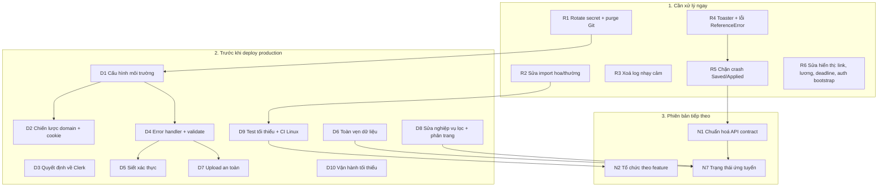

# 12 — Lộ trình cải thiện

> [← Mục lục](00-MUC-LUC.md) · [← 11 Triển khai](11-TRIEN-KHAI-VA-VAN-HANH.md) · Tiếp theo: [13 — Nhận xét dành cho học viên →](13-NHAN-XET-DANH-CHO-HOC-VIEN.md)

## Cách đọc

| Ký hiệu | Ý nghĩa |
|---|---|
| **P0** | Làm ngay, trước mọi việc khác |
| **P1** | Bắt buộc trước khi có người dùng thật |
| **P2** | Nên làm ở phiên bản tiếp theo |
| **P3** | Khi có nhu cầu thực tế |
| **S / M / L** | Ước lượng thô công sức cho một học viên: S ≈ vài giờ, M ≈ 1–3 ngày, L > 3 ngày |

**Nguyên tắc xuyên suốt:**

1. **Sửa, không viết lại.** Không mục nào dưới đây đòi hỏi viết lại dự án.
2. **Mỗi thay đổi kèm một test** chứng minh lỗi đã hết (bắt đầu từ nhóm 1).
3. **Mỗi thay đổi là một commit hoặc Pull Request nhỏ**, có mô tả rõ, để dễ review và rollback.

## Sơ đồ phụ thuộc chính

---

## 1. Cần xử lý ngay

### R1 — Vô hiệu hoá secret đã lộ và làm sạch lịch sử Git

| | |
|---|---|
| **Mã liên quan** | SEC-001, OPS-004 |
| **Lý do** | Secret thật (DB, JWT, Cloudinary) đã nằm trên remote. Mỗi ngày chưa rotate là một ngày dữ liệu có thể bị truy cập. |
| **Ưu tiên / Công sức** | P0 / S–M |
| **Phụ thuộc** | Không. **Làm đầu tiên.** |
| **Việc cần làm** | (1) Đổi mật khẩu DB, sinh JWT secret mới ≥ 32 byte, regenerate Cloudinary secret. (2) Kiểm tra DB có dấu hiệu bị truy cập bất thường. (3) Purge `.env` và `node_modules` khỏi lịch sử bằng `git filter-repo`, rồi force-push. (4) Thêm `.env.example`, `.DS_Store` vào `.gitignore`. (5) Bật GitHub Secret Scanning / Push Protection. |
| **Kết quả mong đợi** | Secret cũ không còn giá trị; `git log --all -- '*.env'` trống; repo nhẹ hơn. |

### R2 — Sửa lỗi phụ thuộc hệ điều hành

| | |
|---|---|
| **Mã liên quan** | ERR-001, OPS-003 |
| **Lý do** | Backend không chạy được trên Linux; repo không checkout đầy đủ được trên Windows. |
| **Ưu tiên / Công sức** | P0 / S |
| **Phụ thuộc** | Không |
| **Việc cần làm** | Sửa `SaveJobControllers.js` thành `saveJobControllers.js` trong import; đổi tên thư mục `skeleton ` thành `skeleton`; `git config core.ignorecase false`. |
| **Kết quả mong đợi** | `node src/index.js` khởi động được trong container Linux. |

### R3 — Xoá log nhạy cảm

| | |
|---|---|
| **Mã liên quan** | SEC-003, CODE-004 (phần log) |
| **Lý do** | Log hiện chứa JWT và password hash; khi deploy, log này nằm trên dashboard hosting. |
| **Ưu tiên / Công sức** | P0 / S |
| **Phụ thuộc** | Không |
| **Việc cần làm** | Xoá `console.log` trong `protectRouter`, `profileUpdate`, `getSavedJobs`, `JobsChecking` và các log debug ở frontend. Lỗi 5xx thì log `console.error(err)` (có stack). |
| **Kết quả mong đợi** | Không còn token, cookie, password nào xuất hiện trong output của server. |

### R4 — Khôi phục phản hồi lỗi cho người dùng

| | |
|---|---|
| **Mã liên quan** | ERR-003, ERR-008, ERR-004, CODE-004 (phần toast) |
| **Lý do** | Hiện người dùng không thấy bất kỳ thông báo nào; hai `ReferenceError` làm hỏng luồng đăng nhập và đổi avatar. |
| **Ưu tiên / Công sức** | P0 / S |
| **Phụ thuộc** | Không. Nên làm **trước R5** để thấy được lỗi trong lúc sửa. |
| **Việc cần làm** | Thêm `<Toaster />`; import `toast` trong LogInPage; sửa `updateProfile` để merge `profilePic` vào `authUser`; bỏ toast success ở các thao tác đọc (`authCheck`, `getJobs`, `fetch*`). |
| **Kết quả mong đợi** | Sai mật khẩu thì thấy thông báo; đổi avatar thì thấy "thành công" và `authUser` vẫn là object; tải trang không có toast thừa. |

### R5 — Chặn crash trang Saved/Applied

| | |
|---|---|
| **Mã liên quan** | ERR-002, DB-001, ARCH-002 (phần save/apply) |
| **Lý do** | Luồng cốt lõi "lưu rồi xem lại" làm trắng toàn app. |
| **Ưu tiên / Công sức** | P0 / M |
| **Phụ thuộc** | R4 (để quan sát lỗi) |
| **Việc cần làm** | (1) Backend: save/apply kiểm tra `Job.exists`, trả 404 nếu không có; trả document đã `populate`. (2) Store dùng đúng shape, hoặc refetch sau khi lưu. (3) Trang Saved/Applied render an toàn khi `jobId` null. (4) Thêm `ErrorBoundary` quanh `<Routes>`. (5) Viết test store: "sau `saveJob`, mọi phần tử có `jobId.title`". |
| **Kết quả mong đợi** | Kịch bản *lưu → mở Saved Jobs* không crash; bookmark mồ côi hiển thị "tin không còn tồn tại" kèm nút xoá. |

### R6 — Sửa nhanh các lỗi hiển thị và điều hướng

| | |
|---|---|
| **Mã liên quan** | BIZ-009, BIZ-003, BIZ-004, ERR-005 |
| **Lý do** | Mỗi lỗi chỉ cần sửa 1–10 dòng nhưng ảnh hưởng trực tiếp tới thông tin cốt lõi (link, lương, hạn nộp) và trải nghiệm F5. |
| **Ưu tiên / Công sức** | P0 / S |
| **Phụ thuộc** | Không |
| **Việc cần làm** | `url={job.sourceUrl}`; hàm `formatSalary` dùng `Intl.NumberFormat` với `currency` và `period`; `deadline={job.jobId.expiredAt}`; `isCheckingAuth: true` làm giá trị khởi tạo. |
| **Kết quả mong đợi** | Nút View Job mở đúng tin; lương hiển thị "$1,200 – $2,000 / month"; deadline trùng giữa trang chủ và trang Saved; F5 ở `/savedJobs` vẫn ở `/savedJobs`. |

---

## 2. Cần xử lý trước khi deploy production

### D1 — Quản lý cấu hình môi trường

| | |
|---|---|
| **Mã liên quan** | OPS-001 (phần URL/CORS), OPS-002, ARCH-003, ERR-007 |
| **Lý do** | Code hiện gắn cứng với localhost và thiếu các thành phần tối thiểu để chạy trên nền tảng. |
| **Ưu tiên / Công sức** | P1 / M |
| **Phụ thuộc** | R1 (secret mới), R2 |
| **Việc cần làm** | `config/env.js` đọc và kiểm tra biến một lần; `CLIENT_URL` cho CORS; `VITE_API_URL` cho axios (kèm `timeout`); script `start`; `nodemon` chuyển sang devDependencies; `engines.node`; `await connectDB()` rồi mới `listen`; `generateToken` chuyển thành hàm đồng bộ; đổi tên `MONGOO_URI`. |
| **Kết quả mong đợi** | Cùng một code chạy được ở local và production chỉ bằng cách đổi biến môi trường; thiếu biến thì dừng ngay với thông báo rõ ràng. |

### D2 — Chiến lược domain và cookie khi deploy

| | |
|---|---|
| **Mã liên quan** | OPS-001 (phần cookie) |
| **Lý do** | Cookie `SameSite=Strict` không được gửi giữa hai domain khác site. |
| **Ưu tiên / Công sức** | P1 / M |
| **Phụ thuộc** | D1 |
| **Việc cần làm** | **Khuyến nghị:** đưa frontend và backend về cùng site (custom domain `app.` + `api.`, hoặc rewrite `/api/*` qua frontend host) để giữ `SameSite` hiện tại. Cấu hình rewrite SPA về `index.html`. Chỉ khi bắt buộc khác site mới chuyển sang `SameSite=None; Secure` + CSRF protection. |
| **Kết quả mong đợi** | Đăng nhập trên môi trường deploy giữ được phiên; F5 ở trang con không 404. |

### D3 — Quyết định về Clerk / Google login

| | |
|---|---|
| **Mã liên quan** | ARCH-001, DEP-001 (phần Clerk) |
| **Lý do** | Tính năng không hoạt động, lại là điểm lỗi đơn cho toàn app. |
| **Ưu tiên / Công sức** | P1 / S (gỡ) hoặc L (tích hợp đúng) |
| **Phụ thuộc** | Không |
| **Việc cần làm** | **Khuyến nghị gỡ** `ClerkProvider`, nút Google, route `/sso-callback`, package. Nếu thật sự muốn có Google login thì đưa vào nhóm 3 với thiết kế xác thực ở backend. |
| **Kết quả mong đợi** | App chạy được mà không cần biến Clerk; không còn nút bấm "giả". |

### D4 — Error handler, validation và mã lỗi chuẩn

| | |
|---|---|
| **Mã liên quan** | VAL-001, ERR-006, ERR-009 |
| **Lý do** | Request sai định dạng gây 500, stack trace hoặc treo; token hết hạn trả 500. |
| **Ưu tiên / Công sức** | P1 / M |
| **Phụ thuộc** | D1 (nên tách `app.js` để test) |
| **Việc cần làm** | Middleware `errorHandler` + 404 JSON; middleware `validate(schema)` (zod/joi) cho từng route; kiểm tra ObjectId; `protectRouter` trả 401 cho lỗi JWT; thay 401 sai chỗ bằng 400/404/409. |
| **Kết quả mong đợi** | Không request nào trả HTML hoặc stack trace; không request nào treo; mã lỗi đúng ngữ nghĩa và có test chứng minh. |

### D5 — Siết xác thực

| | |
|---|---|
| **Mã liên quan** | SEC-002, SEC-004, SEC-006 (phần secret, logout) |
| **Lý do** | Có thể dò email, brute force không giới hạn, JWT secret yếu. |
| **Ưu tiên / Công sức** | P1 / M |
| **Phụ thuộc** | D4 (validate), R1 (secret mới) |
| **Việc cần làm** | Ép kiểu và chuẩn hoá email; một thông báo lỗi chung cho login; `mongoose.set("sanitizeFilter", true)`; `express-rate-limit` cho login/signup; mật khẩu ≥ 8 ký tự; `clearCookie` với đúng tuỳ chọn. |
| **Kết quả mong đợi** | Test chứng minh email sai và mật khẩu sai trả cùng response; gửi request thứ 11 trong 15 phút nhận 429. |

### D6 — Toàn vẹn dữ liệu

| | |
|---|---|
| **Mã liên quan** | DB-002, DB-003, DB-004 |
| **Lý do** | Có thể tạo bản ghi trùng; seed có thể xoá dữ liệu; email phân biệt hoa thường. |
| **Ưu tiên / Công sức** | P1 / M |
| **Phụ thuộc** | D4 (bắt E11000 trả 409) |
| **Việc cần làm** | (1) **Dọn bản ghi trùng trước**, rồi thêm unique index `{ userId, jobId }`. (2) Seed chuyển sang `bulkWrite` upsert theo `sourceUrl`, chặn khi `NODE_ENV=production`, thêm script `seed`. (3) `email` lowercase/trim, chuẩn hoá dữ liệu cũ. (4) Validator `salary.min <= max`; `password` `select: false`. |
| **Kết quả mong đợi** | Double-click Save chỉ tạo 1 bản ghi; chạy seed nhiều lần không làm mồ côi bookmark. |

### D7 — Upload avatar an toàn

| | |
|---|---|
| **Mã liên quan** | SEC-007, BIZ-007 |
| **Lý do** | Upload chưa được kiểm soát; UX gây hiểu nhầm. |
| **Ưu tiên / Công sức** | P1 / M |
| **Phụ thuộc** | D4 |
| **Việc cần làm** | Chỉ nhận data URI ảnh ≤ 2MB; body limit 100kb mặc định, route upload có limit riêng; upload với `public_id` cố định + `overwrite`; frontend kiểm tra kích thước, tách "xem trước" và "lưu", nút "Xoá ảnh" gọi API. |
| **Kết quả mong đợi** | Gửi URL hoặc đường dẫn thì nhận 400; mỗi user chỉ có 1 ảnh trên Cloudinary. |

### D8 — Sửa nghiệp vụ lọc và phân trang

| | |
|---|---|
| **Mã liên quan** | BIZ-001, BIZ-002, BIZ-005, BIZ-006, SEC-005, PERF-001 (phần phân trang) |
| **Lý do** | Hai bộ lọc không hoạt động; hiển thị tin hết hạn; không xem được quá 10 kết quả; regex từ input. |
| **Ưu tiên / Công sức** | P1 / M–L |
| **Phụ thuộc** | D4 (validate query) |
| **Việc cần làm** | (1) Gộp `/getjobs` và `/search` thành `GET /api/jobs` có filter + phân trang + projection. (2) Luôn lọc `isActive: true, expiredAt >= now`. (3) Thống nhất từ điển `region`/`city` (enum, so khớp chính xác). (4) Salary: thiết kế lại contract (`salaryMin/Max + currency + period`). **Nếu chưa kịp làm thì tạm ẩn bộ lọc lương khỏi UI**, vì giao diện trung thực tốt hơn một bộ lọc giả. (5) UI phân trang. |
| **Kết quả mong đợi** | Mỗi bộ lọc có test API chứng minh kết quả đúng; không còn job hết hạn trên UI. |

### D9 — Test tối thiểu và CI trên Linux

| | |
|---|---|
| **Mã liên quan** | TEST-001 |
| **Lý do** | Không có lưới an toàn cho mọi thay đổi ở trên. |
| **Ưu tiên / Công sức** | P1 / M |
| **Phụ thuộc** | R2; nên **bắt đầu song song với R5** và bổ sung dần |
| **Việc cần làm** | Theo [10 §4](10-KIEM-THU-VA-DO-TIN-CAY.md): API test cho auth, bookmark, filter; unit test cho store; 3–4 kịch bản E2E; GitHub Actions trên `ubuntu-latest`; ESLint cho backend. |
| **Kết quả mong đợi** | Mỗi Pull Request đều chạy lint, test, build trên Linux; các lỗi ERR-001, ERR-002, BIZ-001 có test hồi quy. |

### D10 — Vận hành tối thiểu

| | |
|---|---|
| **Mã liên quan** | SEC-008, SEC-009, [11](11-TRIEN-KHAI-VA-VAN-HANH.md) |
| **Lý do** | Không biết khi nào hệ thống lỗi; thiếu hardening cơ bản. |
| **Ưu tiên / Công sức** | P1 / S–M |
| **Phụ thuộc** | D1 |
| **Việc cần làm** | `helmet()`; `NODE_ENV=production`; `/healthz`; error tracking; xác nhận backup DB và thử restore; quyết định `/jobs` công khai hay riêng tư; ảnh avatar mặc định dùng asset nội bộ; tag release; ghi quy trình rollback. |
| **Kết quả mong đợi** | Sự cố được phát hiện trước khi người dùng báo; có đường lui khi deploy lỗi. |

---

## 3. Nên cải thiện trong phiên bản tiếp theo

| Mã lộ trình | Nội dung | Mã liên quan | Lý do | Ưu tiên / Công sức | Phụ thuộc | Kết quả mong đợi |
|---|---|---|---|---|---|---|
| **N1** | Chuẩn hoá API contract (`{ data, meta }` / `{ error }`), viết bảng API trong README | ARCH-002 | Ngăn lặp lại loại lỗi ERR-002 | P2 / M | R5, D4 | Frontend có một hàm xử lý response chung |
| **N2** | Tổ chức backend theo feature; quy ước đặt tên; route REST (`/saved-jobs/:id`) | ARCH-004, CODE-003 | Dễ tìm, dễ mở rộng, giảm lỗi import | P2 / M | D9 (có test để refactor an toàn) | Cấu trúc như gợi ý ở [03 §8](03-KIEN-TRUC-HIEN-TAI.md) |
| **N3** | Gỡ trùng lặp frontend: `PageHeader`, `ListSkeleton`, `ProtectedRoute`, tầng `api/`, selector Zustand | CODE-002, PERF-001 | 5/11 nhóm trùng lặp đã gây lỗi | P2 / M | N1 | Số file component giảm, không còn copy-paste |
| **N4** | Dọn dead code và dependency; xử lý daisyUI/Tailwind; ESLint sạch | CODE-001, DEP-001 | Giảm nhiễu, giảm bề mặt dependency | P2 / S | D3 | `pnpm lint` sạch; không còn package thừa |
| **N5** | UX: card thể hiện đã lưu/đã ứng tuyển, empty state, filter trong URL, responsive, `<Link>` thay `<a>` | BIZ-008, CODE-005 | Trải nghiệm rõ ràng hơn | P2 / M | D8 | Người dùng không phải đoán trạng thái |
| **N6** | README trung thực: hiện trạng, env, seed, API, kiến trúc; thay README frontend | DOC-001, DOC-002 | Portfolio đáng tin cậy | P2 / S | D1, N1 | Người lạ clone về chạy được trong 15 phút |
| **N7** | Tính năng trạng thái ứng tuyển (saved → applied → interviewing → offered/rejected), gộp model `Application` | [07 §8](07-DATABASE-VA-TOAN-VEN-DU-LIEU.md), DOC-001 | Thực hiện đúng tuyên bố "pending" của README; giảm trùng lặp | P2 / L | D6, N1, D8 | Một collection, một bộ API, có migration dữ liệu cũ |

---

## 4. Có thể cân nhắc khi hệ thống tăng trưởng

| Mã lộ trình | Nội dung | Điều kiện kích hoạt | Lý do | Phụ thuộc | Kết quả mong đợi |
|---|---|---|---|---|---|
| **G1** | Nhập dữ liệu job thật (API công khai) bằng worker/scheduler **tách khỏi API**; upsert theo `sourceUrl`; validate `sourceUrl` là `http(s)`; chuẩn hoá lương | Khi thực hiện Roadmap "Integrate public job APIs" | Biến sản phẩm thành aggregator thật | D6, D8 | Dữ liệu tự cập nhật, không chạy trùng khi scale |
| **G2** | Tìm kiếm theo từ khoá (MongoDB text index sẵn có, sau đó mới tới Atlas Search nếu cần) | Khi có Roadmap "search by keyword" | Tận dụng text index đang bị bỏ phí | D8 | Tìm kiếm theo tiêu đề, công ty |
| **G3** | Thu hồi phiên: `tokenVersion`; rút ngắn TTL; cân nhắc refresh token | Khi có tính năng đổi mật khẩu / đăng xuất mọi thiết bị | SEC-006 | D5 | Đăng xuất có hiệu lực ngay |
| **G4** | Observability: log JSON có request id, metrics, alert theo ngưỡng | Khi có người dùng thật thường xuyên | Phát hiện và chẩn đoán sự cố | D10 | Có dashboard và cảnh báo |
| **G5** | Sẵn sàng scale ngang: rate limit dùng store chung, graceful shutdown, tạo index bằng script | Khi cần hơn 1 instance | [09 §6](09-HIEU-NANG-VA-KHA-NANG-MO-RONG.md) | D10 | Deploy không downtime, không đếm sai rate limit |
| **G6** | TypeScript dần dần, hoặc JSDoc + type dùng chung cho API contract | Khi codebase lớn lên hoặc có thêm người cùng làm | Ngăn các lỗi kiểu BIZ-009, ERR-002 ngay trong editor | N1 | Editor cảnh báo khi props hoặc response lệch |
| **G7** | Vai trò `admin` + API quản trị job | Khi cần ẩn/sửa tin mà không truy cập DB trực tiếp | [08 §3.2](08-BAO-MAT-VA-PHAN-QUYEN.md) | G1 | Không còn thao tác tay trên DB |
| **G8** | Email nhắc hạn nộp (queue + worker) | Khi thực hiện Roadmap "Email notifications" | Tác vụ nền đầu tiên thật sự cần queue | G1, N7 | Người dùng nhận nhắc trước hạn |

---

## 5. Những phần chưa nên tối ưu hoặc viết lại

| Đề xuất thường gặp | Vì sao **chưa** nên làm | Làm gì thay thế |
|---|---|---|
| **Viết lại toàn bộ dự án** (hoặc chuyển sang Next.js / NestJS) | Vấn đề hiện tại nằm ở ranh giới, cấu hình và kỷ luật kiểm thử, không nằm ở framework. Viết lại sẽ mang theo đúng những thói quen đó. | Sửa theo nhóm 1–2, có test đi kèm |
| **Tách microservice** | ~800 dòng backend; chi phí vận hành và độ phức tạp tăng gấp nhiều lần | Tổ chức modular monolith theo feature (N2) |
| **Thêm Redis cache / message queue** | Không có truy vấn chậm đã đo; chưa có tác vụ nền | Phân trang, index đúng truy vấn |
| **Chuyển sang SQL** | MongoDB phù hợp; vấn đề nằm ở ràng buộc chưa được khai báo, không nằm ở loại DB | Unique index, validate, kiểm tra tham chiếu (D6) |
| **Docker/Kubernetes tự vận hành** | PaaS (Vercel/Render) đã đủ cho quy mô này | Cấu hình nền tảng + CI |
| **Refresh token + OAuth server riêng** | Quá mức cần thiết; tăng bề mặt lỗi | JWT + cookie hiện tại, siết secret và rate limit (D5) |
| **Thư viện component / design system lớn** | Vấn đề chính là trùng lặp, không phải thiếu thư viện | `PageHeader`, token màu trong Tailwind config (N3) |
| **Đặt mục tiêu 100% test coverage** | Tốn công mà ít giá trị; dễ nản | Test các luồng trong bảng [10 §3](10-KIEM-THU-VA-DO-TIN-CAY.md) |
| **`React.memo` / `useMemo` ở khắp nơi** | Chưa có vấn đề hiệu năng đo được | Selector Zustand (N3) |
| **Thêm index cho mọi trường** | Đang có index thừa | Index theo truy vấn thực tế, kiểm chứng bằng `explain()` |
| **Tự viết cron bằng `node-cron` trong API để tắt job hết hạn** | Lọc bằng truy vấn đơn giản và đúng hơn; cron trong API chạy trùng khi scale | `expiredAt >= now` (D8) |

---

## Phụ lục: bảng truy vết vấn đề sang lộ trình

Mọi vấn đề trong [05](05-DANH-SACH-LOI-VA-RUI-RO.md) đều có mục xử lý tương ứng:

| Nhóm lộ trình | Mã vấn đề được xử lý |
|---|---|
| R1 | SEC-001, OPS-004 |
| R2 | ERR-001, OPS-003 |
| R3 | SEC-003, CODE-004 (log) |
| R4 | ERR-003, ERR-004, ERR-008, CODE-004 (toast) |
| R5 | ERR-002, DB-001, ARCH-002 (một phần) |
| R6 | BIZ-003, BIZ-004, BIZ-009, ERR-005 |
| D1 | OPS-001 (URL/CORS), OPS-002, ARCH-003, ERR-007 |
| D2 | OPS-001 (cookie) |
| D3 | ARCH-001, DEP-001 (Clerk) |
| D4 | VAL-001, ERR-006, ERR-009 |
| D5 | SEC-002, SEC-004, SEC-006 (secret/logout) |
| D6 | DB-002, DB-003, DB-004 |
| D7 | SEC-007, BIZ-007 |
| D8 | BIZ-001, BIZ-002, BIZ-005, BIZ-006, SEC-005, PERF-001 (phân trang) |
| D9 | TEST-001 |
| D10 | SEC-008, SEC-009 |
| N1 | ARCH-002 |
| N2 | ARCH-004, CODE-003 |
| N3 | CODE-002, PERF-001 (selector) |
| N4 | CODE-001, DEP-001 |
| N5 | BIZ-008, CODE-005 |
| N6 | DOC-001, DOC-002 |
| G3 | SEC-006 (thu hồi phiên) |
