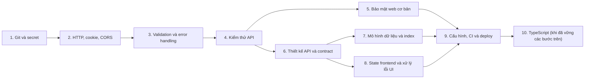

# 13 — Nhận xét dành cho học viên

> [← Mục lục](00-MUC-LUC.md) · [← 12 Lộ trình cải thiện](12-LO-TRINH-CAI-THIEN.md)

## Lời mở đầu

Thầy đã đọc toàn bộ dự án JobRadar, từ `package.json`, từng controller, từng component, cho tới lịch sử commit và ảnh chụp màn hình. Báo cáo này có 50 vấn đề. Con số nghe có vẻ nhiều, nhưng bạn hãy đọc nó đúng cách: **một dự án tự học mà tìm ra được 50 điểm cụ thể để cải thiện, nghĩa là dự án đủ lớn và đủ thật để đáng được phân tích nghiêm túc.** Rất nhiều bài tập "hoàn hảo" chỉ hoàn hảo vì chúng không làm gì cả.

Phần này không nhắc lại từng lỗi (đã có ở [05](05-DANH-SACH-LOI-VA-RUI-RO.md)). Thầy muốn nói về **cách bạn đang tư duy**: phần nào cần giữ, phần nào cần thay đổi.

---

## 1. Những điểm bạn đã làm tốt

| # | Điểm tốt | Bằng chứng | Vì sao đáng ghi nhận |
|---|---|---|---|
| 1 | **Hoàn thành một vòng full-stack thật** | Frontend → store → API → middleware → MongoDB → Cloudinary | Nhiều người học mãi không vượt qua được giai đoạn "làm từng phần riêng lẻ" |
| 2 | **Phân quyền dữ liệu đúng** | Mọi truy vấn saved/applied/delete đều kèm `userId` lấy từ token ([deleteSavedJobControllers.js:17](../backend/src/controllers/deleteSavedJobControllers.js#L17)) | Không có lỗi IDOR, một lỗi rất phổ biến kể cả ở dự án đi làm |
| 3 | **Lưu token đúng chỗ** | Cookie `httpOnly` + `sameSite: "strict"` ([generateToken.js:11-16](../backend/src/utils/generateToken.js#L11-L16)) | Bạn không chỉ làm mà còn **giải thích được vì sao** trong README |
| 4 | **Hash mật khẩu, không trả mật khẩu** | bcrypt; `select("-password")` | Nắm vững nguyên tắc nền tảng |
| 5 | **Không mắc N+1** | Dùng `populate` thay vì vòng lặp truy vấn | Hiểu cách ORM/ODM gom truy vấn |
| 6 | **Schema Job có kỷ luật** | `enum`, `required`, `unique sourceUrl`, có nghĩ tới index | Bạn đã bắt đầu để **database tự bảo vệ dữ liệu** |
| 7 | **UI hướng dữ liệu** | `filterData` trong [JobSidebar.jsx](../frontend/src/components/JobSidebar.jsx#L5-L61) | Tư duy "cấu hình thay vì lặp code" |
| 8 | **Quan tâm tới trải nghiệm** | Skeleton loading, loading theo từng job, dropdown tự đóng khi click ra ngoài và có dọn listener | Những chi tiết mà người mới thường bỏ qua |
| 9 | **Chọn công cụ vừa sức** | Zustand thay Redux, Express thay framework nặng, không over-engineering | Biết đủ là một kỹ năng |
| 10 | **Viết README có phản tư** | Mục "Architecture Decisions" và "What I Learned Building This" | Đây là **điểm sáng lớn nhất** về mặt thái độ học tập |
| 11 | **Có ý thức sửa sai về Git** | Commit "add .env to gitignore", "Remove env files…" | Bạn đã nhận ra vấn đề. Bước còn thiếu là hiểu rằng xoá khỏi HEAD chưa đủ. |

---

## 2. Những tư duy đúng cần phát huy

1. **"Mỗi bug là một bài học."** Câu kết README của bạn là tư duy của người sẽ đi xa. Hãy giữ nó, và nâng lên một bậc: *mỗi bug là một bài học, **và** mỗi bài học phải được biến thành một thứ tự động hoá* (một test, một rule lint, một mục checklist). Có như vậy bài học mới không bị quên.

2. **Giải thích quyết định bằng lý do.** "Why Zustand over Redux?", "Why HTTP-only cookies?" là đúng cách một kỹ sư viết tài liệu. Tiếp tục làm vậy, và **bổ sung đánh đổi** (ví dụ: cookie `SameSite=Strict` an toàn nhưng làm khó việc deploy khác domain).

3. **Backend là nguồn sự thật.** Bạn đã bảo vệ route ở **cả** frontend lẫn backend, không tin frontend. Hãy áp dụng đúng tư duy đó cho **dữ liệu đầu vào**: frontend validate để trải nghiệm tốt, backend validate để an toàn.

4. **Tự làm, không đi theo tutorial.** Nhiều lỗi trong báo cáo xuất hiện chính **vì** bạn tự làm, và đó là cái giá xứng đáng. Người chỉ làm theo tutorial ít gặp lỗi hơn, nhưng cũng học được ít hơn.

---

## 3. Những lỗi mang tính hệ thống cần thay đổi

Đây là phần quan trọng nhất. Những lỗi dưới đây **không phải lỗi gõ nhầm**; chúng là **thói quen tư duy**, và nếu không thay đổi thì chúng sẽ theo bạn sang dự án tiếp theo.

### 3.1. Chỉ nghĩ tới đường thành công (happy path)

**Biểu hiện:** controller xử lý tốt khi dữ liệu đúng, nhưng request thiếu body thì trả stack trace; `profilePic: false` làm request treo; job bị xoá khiến trang Saved crash; token hết hạn trả 500; không có `<Toaster/>` mà suốt thời gian phát triển không ai nhận ra, vì lúc thử bạn toàn nhập đúng.

**Thay đổi:** với mỗi tính năng, trước khi code hãy viết ra 3 câu hỏi:
- *Nếu đầu vào sai kiểu hoặc thiếu thì sao?*
- *Nếu dữ liệu liên quan không còn tồn tại thì sao?*
- *Nếu dịch vụ bên ngoài lỗi thì người dùng thấy gì?*

### 3.2. Hợp đồng ngầm giữa các tầng

**Biểu hiện:** frontend gửi `salary=lt3k`, backend đọc `salary.ranges`; filter gửi "Miền Bắc", dữ liệu là "Vietnam"; store coi `res.data` như một bookmark; `JobCard` đọc `url` trong khi dữ liệu là `sourceUrl`. **Bốn lỗi khác nhau, cùng một nguyên nhân gốc.**

**Thay đổi:** **thiết kế contract trước, code sau.** Chỉ cần một bảng markdown: endpoint, input, output, mã lỗi (như bảng ở [04 §3](04-PHAN-TICH-MODULE-VA-LUONG-DU-LIEU.md)). Mỗi khi đổi một đầu, cập nhật bảng và đầu còn lại trong **cùng một commit**.

### 3.3. "Chạy trên máy mình là xong"

**Biểu hiện:** import sai hoa/thường chỉ chạy được trên macOS; `localhost` gắn cứng; cookie chỉ hợp với localhost; thư mục có dấu cách ở cuối tên; không có `.env.example` nên chỉ máy bạn có cấu hình.

**Thay đổi:** coi **"người khác clone về chạy được"** là định nghĩa của "chạy được". Cách kiểm chứng rẻ nhất: CI trên Linux, hoặc thử clone lại repo vào một thư mục trống rồi làm đúng theo README.

### 3.4. Copy-paste thay vì trừu tượng hoá

**Biểu hiện:** trang Applied hiển thị "Jobs Saved"; toast của Apply ghi "Saving"; LogInPage quên import `toast` (bản copy từ SignUpPage); hai controller save/apply cùng mắc đúng một lỗi.

**Thay đổi:** quy tắc thực dụng: **lần thứ hai copy thì dừng lại và hỏi "hai chỗ này có thay đổi vì cùng một lý do không?"**. Nếu có, tách thành hàm hoặc component. Nếu buộc phải copy, **đọc lại từng chuỗi** trong bản copy.

### 3.5. Bài học được ghi lại nhưng không được áp dụng toàn cục

**Biểu hiện:** README ghi "`<Link>` must replace `<a>`" nhưng Login/Signup vẫn dùng `<a href>`; ghi "Middleware must always end with `res.something()`" nhưng `profileUpdate` vẫn có nhánh không trả response; ghi "protected routes must wait for authCheck" nhưng `isCheckingAuth` khởi tạo `false`.

**Thay đổi:** khi rút ra một bài học, làm thêm hai việc:
1. `grep` toàn dự án tìm mọi chỗ có cùng mẫu lỗi.
2. Biến bài học thành thứ **máy kiểm tra được** (rule lint, test).

### 3.6. Xem nhẹ secret và log

**Biểu hiện:** `.env` được commit ngay từ commit đầu tiên; log in ra cookie và password hash; JWT secret rất ngắn.

**Thay đổi:** đây là vùng **không có "thử rồi sửa"**, vì một secret đã push lên thì coi như đã lộ. Tạo `.gitignore` **trước** commit đầu tiên của mọi dự án. Trước mỗi `console.log`, tự hỏi *"dòng này có in ra dữ liệu của người dùng không?"*.

### 3.7. Thêm công nghệ trước khi dùng hết cái đang có

**Biểu hiện:** Clerk (nửa vời), `node-cron` (không dùng), `react-icons` (không dùng), daisyUI 5 đi với Tailwind 3, line-clamp plugin (thừa).

**Thay đổi:** mỗi package mới phải trả lời được: *"nó giải quyết vấn đề nào **đang có**?"* và *"mình đã tích hợp nó **end-to-end** chưa?"*. Nếu chưa thì chưa cài.

### 3.8. Tài liệu mô tả ý định hơn là hiện trạng

**Biểu hiện:** "job aggregator", "Search 1000+ jobs", "which are still pending", "single query".

**Thay đổi:** tách README thành **"Đã làm được"** và **"Roadmap"**. Nhà tuyển dụng kỹ thuật đánh giá cao sự trung thực hơn sự phô trương, vì họ **sẽ** đọc code.

---

## 4. Những kiến thức bạn đang thiếu

| Lĩnh vực | Biểu hiện trong dự án | Mức cần đạt tiếp theo |
|---|---|---|
| **Git & quản lý secret** | `.env` trong lịch sử; `node_modules` từng bị commit | Hiểu Git lưu lịch sử thế nào; `.gitignore` từ đầu; biết rotate và purge |
| **HTTP semantics** | 401 cho mọi loại lỗi; 500 cho token hết hạn | Phân biệt 400/401/403/404/409/422/500; hiểu cookie attribute và CORS |
| **Validation & xử lý lỗi backend** | Không validate kiểu; `try/catch` đặt sai chỗ; không có error handler | Middleware validate theo schema; error handler tập trung; hiểu thay đổi của Express 5 |
| **Bảo mật web cơ bản** | Dò email, không rate limit, log token, upload không kiểm soát | OWASP Top 10 ở mức nhận diện và phòng tránh; nguyên tắc "không tin input" |
| **Thiết kế API** | Shape response không thống nhất; route không theo REST | REST resource naming; response envelope; viết tài liệu API trước |
| **Mô hình dữ liệu MongoDB** | Thiếu unique compound index; không kiểm tra tham chiếu; index không theo truy vấn | Ràng buộc bằng index; referential integrity ở tầng app; `explain()` |
| **Quản lý state ở frontend** | Shape trong store lẫn lộn; không dùng selector; không có ErrorBoundary | Chuẩn hoá state; selector; error boundary; khi nào refetch, khi nào cập nhật lạc quan (optimistic update) |
| **Kiểm thử** | 0 test | Viết được API test (supertest), unit test store, 1 E2E; hiểu kiểm thử để làm gì |
| **Cấu hình & triển khai** | Hard-code localhost; không có `start`; không có CI | 12-Factor config; CI cơ bản; khái niệm "site" và cookie khi deploy |
| **Đọc tài liệu thư viện** | `jwt.verify` ném lỗi chứ không trả `null`; `populate` là 2 truy vấn; daisyUI 5 cần Tailwind 4 | Thói quen đọc docs và changelog **trước** khi dùng API |

---

## 5. Thứ tự kiến thức nên học bổ sung

Thứ tự này được sắp theo **mức độ rủi ro trong dự án** và theo **phụ thuộc giữa các kiến thức**. Mỗi bước đều có bài tập áp dụng ngay vào JobRadar, để bạn học đi đôi với sửa.

| Bước | Chủ đề | Vì sao ở vị trí này | Bài tập áp dụng vào JobRadar |
|---|---|---|---|
| 1 | **Git và quản lý secret** | Rủi ro cao nhất, đang xảy ra | Làm R1: rotate, purge lịch sử, tạo `.env.example` |
| 2 | **HTTP: status code, cookie, CORS, SameSite** | Nền tảng để hiểu các bước sau | Viết lại bảng API catalog với mã lỗi đúng; giải thích bằng lời vì sao cookie hiện tại không chạy được khi dùng Vercel + Render |
| 3 | **Validation và error handling trong Express 5** | Ngăn phần lớn lỗi 500 và request treo | Làm D4: middleware `validate` + `errorHandler` |
| 4 | **Kiểm thử API** (supertest + mongodb-memory-server) | Tạo lưới an toàn **trước khi** refactor | Viết 10 test đầu tiên trong [10 §4.2](10-KIEM-THU-VA-DO-TIN-CAY.md) |
| 5 | **Bảo mật web cơ bản** (OWASP Top 10) | Có test rồi mới sửa bảo mật một cách an toàn | Làm D5; viết test chứng minh không dò được email |
| 6 | **Thiết kế REST API và contract** | Gốc rễ của nhiều lỗi FE–BE | Làm N1; chuẩn hoá response |
| 7 | **Mô hình dữ liệu MongoDB, index, `explain()`** | Cần contract ổn định trước | Làm D6; chạy `explain()` cho truy vấn search trước và sau khi đổi |
| 8 | **State frontend, ErrorBoundary, selector** | Dựa trên contract đã chuẩn | Làm R5, N3 |
| 9 | **Cấu hình môi trường, CI/CD, deploy** | Tổng hợp mọi thứ ở trên | Làm D1, D2, D9, D10; deploy thật |
| 10 | **TypeScript** | Học sau cùng, khi đã hiểu *vì sao* cần kiểu dữ liệu | Thêm type cho API contract |

> **Lời khuyên:** đừng học 10 bước rồi mới sửa. Hãy **học một bước, sửa phần tương ứng, commit, rồi mới sang bước tiếp theo.** Đến bước 9, bạn sẽ có một dự án đã deploy và một lịch sử commit kể lại quá trình trưởng thành. Chính lịch sử đó mới là portfolio thật sự.

---

## 6. Những bài học quan trọng rút ra từ dự án

1. **Lỗi nguy hiểm nhất thường nằm ở ranh giới giữa các thành phần, không nằm bên trong từng thành phần.** Từng file của bạn đều khá dễ đọc; phần lớn lỗi nằm ở chỗ các file nói chuyện với nhau.

2. **"Chạy được" có nhiều cấp độ:** chạy trên máy mình → chạy trên máy người khác → chạy trên production → chạy đúng khi có lỗi → chạy đúng sau khi được sửa đổi. Dự án đang ở cấp độ 1.

3. **Trên Git, xoá không có nghĩa là mất.** Mọi thứ từng được push đều phải coi như đã công khai.

4. **Một bài học chỉ thật sự được học khi máy tự kiểm tra được nó.** Ghi vào README thì dễ quên, biến thành test hay lint thì không quên được.

5. **Trùng lặp nhân bản cả lỗi.** 5/11 nhóm code trùng lặp trong dự án đã sinh ra lỗi thật.

6. **Để database tự bảo vệ dữ liệu.** `findOne` rồi `create` không chống trùng được; unique index thì chống được.

7. **Một tính năng dang dở còn tệ hơn không có tính năng.** Nút "Continue with Google" không hoạt động, bộ lọc lương không có tác dụng: người dùng mất niềm tin vào **cả** những phần đang chạy tốt.

8. **Thông báo lỗi là một phần của sản phẩm.** Code xử lý lỗi hoàn chỉnh mà không hiển thị được (thiếu `<Toaster/>`) thì với người dùng cũng giống như không có.

---

## 7. Đánh giá tổng thể

### 7.1. Theo từng tiêu chí

> Điểm mang tính **định hướng**, dùng để bạn so sánh tiến bộ giữa các lần review, không phải để xếp hạng.

| Tiêu chí | Điểm /10 | Nhận xét ngắn |
|---|---|---|
| Hoàn thiện chức năng | 6 | Đủ luồng chính; nhiều lỗi nghiệp vụ ở bộ lọc và hiển thị; hai luồng crash |
| Kiến trúc và tổ chức | 5,5 | Mô hình đúng và vừa sức; ranh giới module và đặt tên chưa chặt |
| Chất lượng code | 4,5 | Hàm ngắn, dễ đọc; trùng lặp, naming và error handling yếu |
| Bảo mật | 4 | Phân quyền dữ liệu **tốt**; nhưng secret đã lộ, thiếu validate và rate limit |
| Database và toàn vẹn dữ liệu | 5 | Schema Job tốt; thiếu ràng buộc ở bookmark; seed nguy hiểm |
| Kiểm thử | 1 | Chưa có |
| Triển khai và vận hành | 2 | Chưa deploy được nếu không sửa code |
| Tài liệu và tư duy phản tư | 6,5 | README có chiều sâu suy nghĩ; nhưng chưa khớp hiện trạng |

### 7.2. Kết luận

**Nếu xét là một dự án tự học full-stack đầu tay:** bạn đạt mức **khá**. Bạn đã tự xây được một hệ thống có đầu có cuối, đưa ra một số quyết định bảo mật đúng, và có thói quen suy ngẫm sau khi gặp lỗi. Không phải ai ở giai đoạn này cũng làm được như vậy.

**Nếu xét là một portfolio để ứng tuyển, hoặc một sản phẩm cho người dùng thật:** dự án **chưa đạt**. Lý do không phải vì thiếu tính năng, mà vì thiếu **độ tin cậy**: secret bị lộ, không deploy được, có luồng crash, không có test. Người review kỹ thuật sẽ nhìn thấy những điểm này trong vòng 15 phút đọc code.

**Tin tốt là khoảng cách này hoàn toàn có thể thu hẹp mà không cần viết lại.** Hoàn thành **nhóm 1 và nhóm 2** trong [lộ trình](12-LO-TRINH-CAI-THIEN.md) (phần lớn là các thay đổi nhỏ, có mục tiêu rõ) sẽ đưa JobRadar từ "dự án học tập" lên "dự án portfolio đáng tin cậy". Quan trọng hơn, bạn sẽ học được những kỹ năng mà tutorial hiếm khi dạy: làm cho phần mềm **đúng khi mọi thứ không như mong đợi**.

---

## Lời kết

README của bạn kết thúc bằng câu: *"The real learning wasn't in writing the code — it was in debugging it."*

Thầy muốn bổ sung thêm một vế: **bước học tiếp theo nằm ở việc làm sao để lần sau không phải debug lại cùng một lỗi.** Đó là lúc bạn chuyển từ *người viết code* sang *kỹ sư phần mềm*.

Chúc bạn sửa lỗi vui vẻ. Thầy mong được đọc phiên bản tiếp theo của JobRadar.
